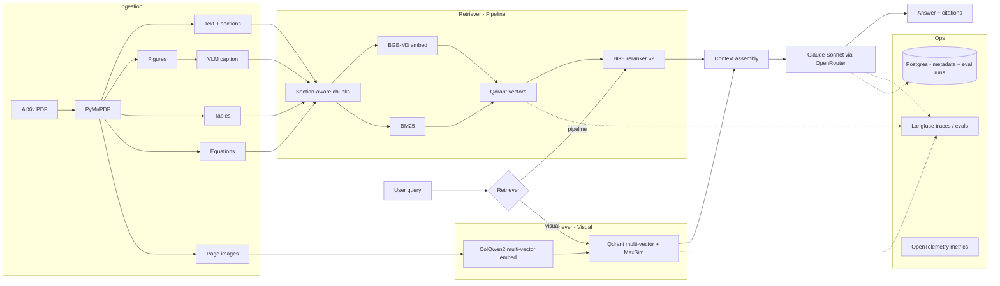

# Multi-modal Paper RAG

> A production-grade RAG system for scientific papers (ArXiv ML corpus) that
> compares **visual document retrieval (ColQwen2)** against a **multi-modal
> pipeline (text + figure captioning + table extraction)** on the same
> corpus, wrapped in a full LLMOps stack.

The headline is the comparison itself, evaluated with a QASPER-style golden
set under regression gates. The secondary story is the production engineering:
provider abstraction, prompt versioning, hybrid retrieval, eval harness,
observability, IaC, CI/CD.

The full specification lives in [`PROJECT.md`](./PROJECT.md). This README is
the entry point for running the project.

---

## Architecture



---

## Status

| Phase | Scope | Status |
|-------|-------|--------|
| 1 - Text-only baseline | Text RAG, hybrid + rerank, Langfuse, eval harness | scaffold complete |
| 2 - Pipeline multi-modal | Figures (VLM-captioned), tables (markdown), equations | not started |
| 3 - ColQwen2 visual path | colpali-engine, page rendering, multi-vector Qdrant, multi-modal generator | not started |
| 4 - Production polish | Terraform on Azure Container Apps, full CI/CD, guardrails, ADRs | not started |

---

## Quickstart

Prerequisites: Python 3.12, [uv](https://docs.astral.sh/uv/), Docker + Docker Compose.

```bash
git clone <repo-url> multi-modal-paper-rag
cd multi-modal-paper-rag
uv sync --extra dev
cp .env.example .env  # fill in keys when retrieval/generation lands
docker compose up -d qdrant postgres langfuse ollama
docker exec rag-ollama ollama pull bge-m3   # one-off
uv run uvicorn src.api.main:app --reload --port 8000
```

Verify:

```bash
curl http://localhost:8000/health
```

---

## Development

```bash
uv run ruff check .          # lint
uv run ruff format .         # format
uv run mypy src tests        # type check (strict)
uv run pytest -v             # unit tests
```

CI runs the same four checks on every push and PR — see `.github/workflows/ci.yml`.

---

## Project layout

The full structure and architectural rules are documented in [`PROJECT.md`](./PROJECT.md).
Top-level packages already in place:

- `src/types/` — Pydantic models shared across modules
- `src/config/` — Pydantic Settings + YAML defaults
- `src/llm/` — `LLMClient` Protocol and OpenRouter implementation
- `src/embeddings/` — `Embedder` Protocol and Ollama BGE-M3 implementation
- `src/api/` — FastAPI app (`/health`, `/query` placeholder)

Modules added in later phases: `src/ingestion/`, `src/rag/`, `src/prompts/`,
`src/eval/`, `src/guardrails/`, `src/observability/`.

---

## Eval results

Eval results table will be populated once Phase 1 retrieval lands. See
`docs/evals.md` (created in Phase 4 docs polish) for methodology.

---

## License

MIT.
