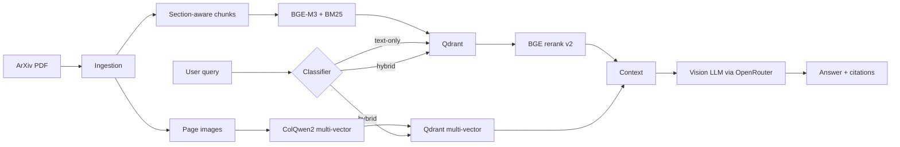

# Multi-modal Paper RAG

[](https://github.com/NorthernLightx/prismrag/actions/workflows/ci.yml)
[](https://github.com/NorthernLightx/prismrag/actions/workflows/docker.yml)
[](https://github.com/NorthernLightx/prismrag/actions/workflows/security.yml)
[](https://www.python.org/downloads/release/python-3120/)
[](./LICENSE)

> Multi-modal RAG for scientific papers, with eval-gated tradeoffs between
> text and visual retrieval.

A retrieval pipeline over arXiv ML papers that compares **text retrieval**
(BM25 + BGE-M3 dense + RRF + BGE-rerank) against **visual retrieval**
(ColQwen2 multivector + late-interaction MaxSim) and routes per-query.
Each lift is measured against committed baselines and gated in CI.

## Headline results

Stress-tested on [MMLongBench-Doc](https://arxiv.org/abs/2407.01523) — 20
docs / 149 queries, page-level scoring, gpt-4o-mini for generation + judge:

| Stack | recall@10 | figure subset recall@10 |
|---|---|---|
| text-only | 0.6854 | 0.6378 |
| **router (text + visual)** | **0.7515** | **0.7356** |
| Δ rel | **+9.6 %** | **+15.3 %** |

Three lifts compose end-to-end: visual retriever (+9.6 % recall@10),
LLM zero-shot dispatch (+54 pp hybrid coverage on figure queries vs the
regex baseline), and vision generator (+89 % gold-answer match on
figure-grounded queries). Full methodology + per-category breakdowns in
[`docs/results.md`](./docs/results.md); committed baselines under
[`data/eval/`](./data/eval/).

## Architecture



Per-decision detail in [`docs/decisions/`](./docs/decisions/) (8 ADRs).

## Quickstart

```bash
git clone https://github.com/NorthernLightx/prismrag
cd multi-modal-rag
uv sync --extra dev
cp .env.example .env
docker compose up -d qdrant postgres langfuse ollama
docker exec rag-ollama ollama pull bge-m3

uv run python -m scripts.bootstrap_corpus --pdf-dir data/papers
uv run uvicorn src.api.main:app --reload --port 8000
```

Open <http://localhost:8000/> for the BYOK UI — paste your own OpenRouter
key (never sent to this server), the browser calls `/query` for retrieval
and dispatches the chat call directly to OpenRouter. Vision-capable models
(`gpt-4o`, `claude-sonnet-4.x`, `qwen3-vl`) read page PNGs as image
content blocks when `RAG_PAGES_DIR` is set (run
`python -m scripts.render_pages --pdf-dir data/papers` to fill it).

`/health` gates the lifespan handler's wiring; `/answer` exists for direct
API users (returns 503 until OpenRouter key + Qdrant collection are both
ready).

## What's in here

- **Hybrid text retrieval** — BM25 + BGE-M3 dense + RRF + BGE-rerank-v2-m3
- **Visual retrieval** (opt-in, GPU) — ColQwen2 multivector + late-interaction MaxSim
- **Per-query routing** — regex baseline + opt-in LLM zero-shot classifier (ADR 0008)
- **Eval framework** — golden YAML, retrieval + generation metrics, LLM-as-judge,
  committed baselines + regression gate (`scripts/check_regression.py`)
- **Generation** — OpenRouter via BYOK from the bundled UI; vision LLM gets
  page PNGs as image content blocks
- **Production polish** — FastAPI + StaticFiles, OTel + Sentry + Langfuse,
  GitHub Actions CI/CD (lint + typecheck + tests + container build), Cloud
  Run deploy via Workload Identity Federation (`google-github-actions/deploy-cloudrun`)

## Limitations

- **Visual retrieval needs a CUDA GPU.** The hosted demo runs CPU-only on
  Azure Container Apps; visual *retrieval* is local-only. Vision
  *generation* still works on the demo via OpenRouter.
- **Generation is BYOK.** Visitors paste their own OpenRouter API key;
  calls go browser-direct. The server doesn't proxy or store keys.
- **Curated 20-paper demo corpus.** No upload UI. Local users bring their
  own PDFs (see *Bring your own PDFs* below).
- **LLM-as-judge known bias.** Faithfulness is systematically underrated
  when the answer lives in pixels (e.g., *"the line is red"* — judge sees
  only text). MMLongBench-Doc gold-answer match is the channel to trust.
- **Scale-to-zero.** Demo `min-replicas=0` means cold-start latency on
  the first request after idle.

## Bring your own PDFs (local)

The hosted demo runs against the curated 20-paper corpus baked into the
container image. Locally, point `bootstrap_corpus.py` at any directory:

```bash
mkdir mydocs                                # drop your .pdf files here
uv run python -m scripts.bootstrap_corpus \
    --pdf-dir ./mydocs --collection my_corpus
```

Then in `.env`: `RAG_CORPUS_COLLECTION=my_corpus`. Restart `uvicorn` and
your PDFs are queryable via `/query` and the bundled UI. The eval harness
(`scripts/eval_run.py`, `scripts/check_regression.py`) works against any
collection — write a golden YAML at `data/golden/<name>.yaml`.

For the visual retrieval leg (CUDA GPU, ~7 GB VRAM):

```bash
uv run python -m scripts.render_pages --pdf-dir ./mydocs --out-dir data/pages
```

```
RAG_ENABLE_MULTIMODAL=true
RAG_PAGES_DIR=data/pages
```

## Common issues

- **`PDFInfoNotInstalledError: poppler not installed`** — `pdf2image`
  shells out to poppler. Linux: `apt install poppler-utils`. macOS:
  `brew install poppler`. Windows: download from
  [oschwartz10612/poppler-windows](https://github.com/oschwartz10612/poppler-windows)
  and add `bin/` to `PATH`.
- **`model 'bge-m3' not found`** — Ollama hasn't pulled the embedding
  model. `docker exec rag-ollama ollama pull bge-m3`.
- **`Vector dimension error: expected 1024, got 768`** — the Qdrant
  collection was created with a different embedder. Drop + re-ingest:
  `bootstrap_corpus.py --pdf-dir … --force`.
- **`torch.cuda.OutOfMemoryError` from ColQwen2** — disable with
  `RAG_ENABLE_MULTIMODAL=false`, or run on a GPU with ≥12 GB VRAM.

## Development

```bash
uv run ruff check . && uv run ruff format --check .
uv run mypy src tests scripts                          # strict
uv run pytest -v                                       # 351 tests
```

CI runs the same set on every push and PR. To run them locally before
each push (plus a gitleaks Docker scan), enable the in-tree pre-push
hook once per clone:

```bash
git config core.hooksPath .githooks
```

## Project layout

```
src/         # FastAPI app, retrievers, ingestion, eval, observability
scripts/    # CLI entry points (bootstrap, render, eval, regression)
web/        # bundled BYOK frontend (single index.html)
data/       # gitignored except curated_demo/papers.txt + eval baselines
docs/       # ADRs, eval methodology, results
```

ADRs ([`docs/decisions/`](./docs/decisions/)) document every non-obvious
choice — text-only baseline, contextual retrieval, multi-modal chunks,
query expansion (rejected), visual retrieval, hybrid fusion, OOC refusal
gate, per-query routing.

## License

MIT — see [`LICENSE`](./LICENSE).
