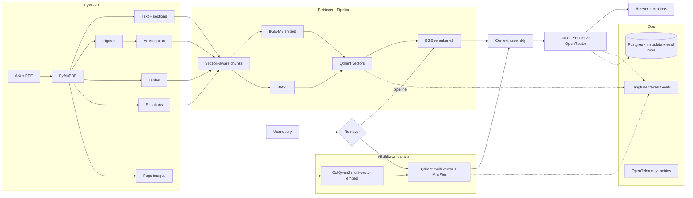

# Multi-modal Paper RAG

> A production-grade RAG system for scientific papers (ArXiv ML corpus) that
> compares **visual document retrieval (ColQwen2)** against a **multi-modal
> pipeline (text + figure captioning + table extraction)** on the same
> corpus, wrapped in a full LLMOps stack.

The headline is the comparison itself, evaluated with a QASPER-style golden
set under regression gates. The secondary story is the production engineering:
provider abstraction, prompt versioning, hybrid retrieval, eval harness,
observability, IaC, CI/CD.

The full specification lives in [`PROJECT.md`](./PROJECT.md). This README is
the entry point for running the project.

---

## Architecture



---

## Status

| Phase | Scope | Status |
|-------|-------|--------|
| 1 — Text-only baseline | BM25 + dense + RRF + BGE rerank, generator, RAGAS-style judge | ✅ closed (`baseline.json` = `7b5242df5b38`) |
| 2.0 — Figure + table extraction | PyMuPDF figures + tables → chunks | ✅ accepted, opt-in via `--extract-figures --extract-tables` |
| 2.1 — VLM captioning | Vision-LM captions for figures (recommended `minicpm-v:8b`) | ✅ accepted, opt-in via `--vlm-caption-model` |
| 2.2 — Query expansion | LLM rewrite / HyDE / combo with RRF fusion | ❌ rejected default-off; per-query wins kept in tree |
| 3 — Visual retrieval | ColQwen2 multi-vector + late-interaction MaxSim | ✅ accepted as complementary path (`scripts/eval_visual.py`) |
| 3.1 — Hybrid text + visual fusion | Offline RRF over text+visual at page granularity, golden v3 | ✅ closed; rejected as default — figure/table subset shows +1.9% nDCG@5, motivating routing |
| 3.2 — Per-query routing | Route by query category (text-only vs hybrid) per ADR 0008 | ✅ closed (run `6447247ef8e7` — hybrid-routed figure+table queries 0.876 nDCG@5 vs 0.732 on text-routed factual/equation; routing dispatches correctly per category) |
| 4 — Production polish | Terraform / Azure Container Apps / OTel / Sentry | 🟡 scaffold landed; first apply pending |

ADRs cover every non-obvious decision in [`docs/decisions/`](./docs/decisions/).

---

## Quickstart

Prerequisites: Python 3.12, [uv](https://docs.astral.sh/uv/), Docker + Docker Compose.

```bash
git clone <repo-url> multi-modal-paper-rag
cd multi-modal-paper-rag
uv sync --extra dev
cp .env.example .env  # fill in keys when retrieval/generation lands
docker compose up -d qdrant postgres langfuse ollama
docker exec rag-ollama ollama pull bge-m3   # one-off
uv run uvicorn src.api.main:app --reload --port 8000
```

Verify:

```bash
curl http://localhost:8000/health
```

---

## Development

```bash
uv run ruff check .          # lint
uv run ruff format .         # format
uv run mypy src tests        # type check (strict)
uv run pytest -v             # unit tests
```

CI runs the same four checks on every push and PR — see `.github/workflows/ci.yml`.

To run the same gates locally before every push (plus a gitleaks secret scan
via Docker), enable the in-tree pre-push hook once per clone:

```bash
git config core.hooksPath .githooks
```

The hook lives at `.githooks/pre-push`; bypass with `git push --no-verify`
when needed.

---

## Project layout

The full structure and architectural rules are documented in [`PROJECT.md`](./PROJECT.md).
Top-level packages already in place:

- `src/types/` — Pydantic models shared across modules
- `src/config/` — Pydantic Settings + YAML defaults
- `src/llm/` — `LLMClient` Protocol and OpenRouter implementation
- `src/embeddings/` — `Embedder` Protocol and Ollama BGE-M3 implementation
- `src/api/` — FastAPI app (`/health`, `/query` placeholder)

Modules added in later phases: `src/ingestion/`, `src/rag/`, `src/prompts/`,
`src/eval/`, `src/guardrails/`, `src/observability/`.

---

## Eval results

Golden v2 — 5 papers, 23 queries (17 in-corpus). Production stack:
BM25 + dense + RRF → BGE-v2-m3 cross-encoder rerank → qwen2.5:7b
generate + judge.

| Metric | Value |
|---|---|
| nDCG@5 (in-corpus macro) | 0.7214 |
| recall@10 (in-corpus macro) | 0.9412 |
| MRR (in-corpus macro) | 0.7437 |
| citation grounding | 1.0000 |
| faithfulness (LLM judge) | 0.8587 |
| answer relevance (LLM judge) | 0.8261 |
| context precision (LLM judge) | 0.6304 |
| p50 whole-query latency | ~73 s |
| p50 rerank stage on GPU | ~5.5 s |

CI regression gate fails the build if any metric drops by > 5%
(`scripts/check_regression.py`).

Phase 3.1 follow-up — golden v3 (39 queries, 20 papers, retrieval-only):

| Stack | nDCG@5 | recall@10 | MRR |
|---|---|---|---|
| text @ page (chunks → page granularity) | **0.8628** | 1.0000 | **0.8167** |
| visual (ColQwen2-v1.0 only) | 0.6780 | 0.9677 | 0.6637 |
| hybrid (RRF text + visual at page level) | 0.8226 | 1.0000 | 0.7826 |

The split that motivates Phase 3.2 routing: on the 14 figure/table-targeted
queries (q24–q39 in-corpus), hybrid edges text @ page (+1.9% nDCG@5);
on the 17 definitional v2 queries, hybrid loses (−10.6%).
Full analysis in
[`docs/decisions/0007-phase31-corpus-expansion-and-hybrid-fusion.md`](./docs/decisions/0007-phase31-corpus-expansion-and-hybrid-fusion.md).

Phase 3.2 router — golden v3, retrieval-only with `--rerank --router`
(run `6447247ef8e7`, ADR 0008):

| Routed category | n | mean nDCG@5 | path |
|---|---|---|---|
| equation | 1 | 1.000 | text-only |
| factual | 13 | 0.712 | text-only |
| **figure** | **11** | **0.876** | **hybrid (RRF page-level)** |
| **table** | **4** | **0.875** | **hybrid (RRF page-level)** |
| multi_hop | 2 | 0.619 | hybrid |
| out_of_corpus | 8 | 0.000 | (correct — no relevant chunks) |
| **Aggregate (in-corpus n=31)** | | **0.7942** | mixed |

The router fires hybrid for `figure`/`table`/`multi_hop` and stays
text-only for `factual`/`definitional`/`equation`, exactly per the
ADR 0007 §"Implications" oracle. Hybrid-routed figure+table queries
score 0.876 mean — well above the chunk-level text baseline. Text-routed
factual queries score 0.712 — within noise of the chunk-level baseline
0.7214 from `baseline.json`. Aggregate 0.7942 is below ADR 0007's
all-page-level numbers because the router mixes granularities (chunk-
level for text-only, page-level for hybrid); the per-category numbers
are the apples-to-apples comparison.
See [`docs/decisions/0008-phase32-routing.md`](./docs/decisions/0008-phase32-routing.md).

---

## License

MIT.
