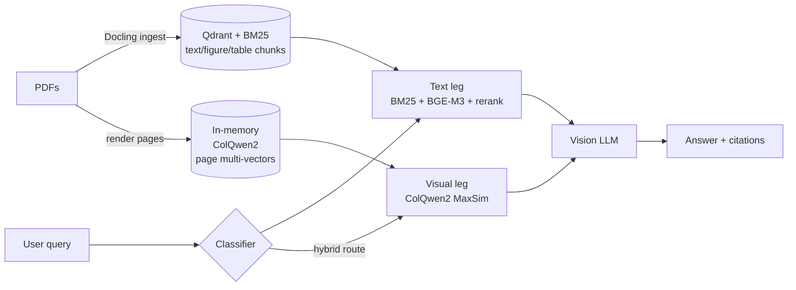

# PrismRAG

> Question answering over PDFs whose answers live in figures, charts, and
> tables, where text-only search comes up short. Two retrievers, a per-query
> router, and an eval behind every change.

[](https://github.com/NorthernLightx/prismrag/actions/workflows/ci.yml)
[](https://github.com/NorthernLightx/prismrag/actions/workflows/docker.yml)
[](https://github.com/NorthernLightx/prismrag/actions/workflows/security.yml)
[](https://www.python.org/downloads/release/python-3120/)
[](./LICENSE)

**▶ Live demo: <https://prismrag-ar6wxit42a-ew.a.run.app>**

## The problem

A PDF's text layer is only half the document. Ask an ordinary RAG system
*"in Figure 5, what colour is the line with no intersections?"* and it will
tell you the answer isn't in the context. It's right: the colour lives in the
chart's pixels, not the text. The same blind spot covers plot geometry,
screenshots, and image-only diagrams.

PrismRAG runs a text retriever and a visual retriever over rendered page
images, and a per-query classifier decides which to use. When a question is
visual, the page image is sent to a vision model at answer time. The corpus
here is scientific PDFs and MMLongBench-Doc, but nothing is domain-specific:
point the ingester at any folder of `.pdf` files.

## Result

Page-level retrieval on [MMLongBench-Doc](https://arxiv.org/abs/2407.01523)
(20 documents, 149 queries, 107 in-corpus). The metric is recall@10 over
retrieved pages, scored paper-aware (a page counts only if it is the gold
paper's), so it is independent of any generator. The router uses an
LLM classifier (`gemma3:4b` via Ollama) to send figure and table queries to
the visual leg.

| retrieval | recall@10 | figures only |
|---|---|---|
| text-only | 0.55 | 0.51 |
| **text + visual router** | **0.75** | **0.76** |
| relative lift | **+35 %** | **+48 %** |

The exact values (text-only 0.5545, router 0.7461; figure subset 0.5111 →
0.7578) and the per-query records are committed under
[`data/eval/`](./data/eval/) as `baseline-mmlongbench-text.json` and
`baseline-mmlongbench-router.json`.

The gain is mechanical, not a metric artefact: on every figure query that
improved, the router retrieved a page the text leg never returned, while
text-routed (factual) queries scored identically across both runs.
MMLongBench-Doc answers are ~93 % visual, which rewards routing
aggressively to the visual leg. On a text-heavy corpus the lift is smaller. Full methodology and failure modes are in
[`docs/results.md`](./docs/results.md).

## How it works



1. **Ingest.** Each PDF goes through [Docling](https://github.com/docling-project/docling)
   for layout-aware, section-attributed text chunks plus figure and table
   extraction, with a figure-role classifier separating real figures from
   page decoration. Text, figure, and table chunks are indexed
   twice: BGE-M3 dense vectors in Qdrant and a BM25 sparse index in process.
   Pages are rendered to PNG, and ColQwen2 embeds each page into a
   multi-vector tensor held in memory.
2. **Classify.** A per-query classifier routes to text-only or text+visual.
   The default is an LLM zero-shot classifier (`gemma3:4b` over Ollama, no
   API key); a regex classifier is the fallback.
3. **Retrieve.** The text leg (BM25 + BGE-M3 dense + reciprocal-rank fusion +
   BGE-reranker-v2-m3) always runs. On hybrid routes the visual leg
   (ColQwen2 late-interaction MaxSim over page images) also runs, and the two
   fuse at page granularity.
4. **Generate.** A vision-capable model reads the retrieved chunks and their
   page images and returns an answer with chunk-level citations.

## Quickstart

```bash
git clone https://github.com/NorthernLightx/prismrag
cd prismrag
uv sync --extra dev
cp .env.example .env
docker compose up -d qdrant postgres langfuse ollama
docker exec rag-ollama ollama pull bge-m3

uv run python -m scripts.bootstrap_corpus --pdf-dir data/papers
uv run uvicorn src.api.main:app --reload --port 8000
```

Then open:

- <http://localhost:8000/> — conversational chat UI (fresh retrieval per turn,
  with a query-condense step on follow-ups)
- <http://localhost:8000/inspection.html> — single-shot retrieval inspection:
  force the route, set top-K, filter by paper, and see the route the server chose
- <http://localhost:8000/figures.html> — figure browser: every figure and
  table chunk with bbox-highlighted thumbnails and caption search

Both query UIs carry an Advanced panel to force the retrieval route, switch
intent vs cascade routing, set top-K, and filter by paper; the response shows
the route the server actually chose. The Inspection page also has an experimental
agentic-search toggle (DCI; ADR [0026](./docs/decisions/)): an LLM agent greps the corpus with
terminal-style tools instead of vector search. It is off by default, text-only,
and slower, so it is a showcase rather than the default path.

Generation is bring-your-own-key. Paste an OpenRouter key into the UI and the
chat call goes browser-direct to OpenRouter; the server only handles
retrieval (`/query`) and never sees, logs, or stores the key. The one exception
is the opt-in DCI mode, whose agent runs server-side: it holds your key in
memory for that request only, never stored or logged. Vision-capable
models (`gpt-4o`, `claude-sonnet-4.x`, `qwen3-vl`) receive the retrieved page
PNGs as image blocks when `RAG_PAGES_DIR` is set; populate it with
`python -m scripts.render_pages --pdf-dir data/papers`.

API surface:

- `/health` — component-wiring check (status, version, env, `pages_available`)
- `/query` — retrieval only, no generation
- `/answer` — server-side generation; returns 503 until both an OpenRouter
  key and a populated Qdrant collection are present (so the public demo
  serves retrieval, and generation stays browser-side)

## Bring your own PDFs

The hosted demo runs a fixed 20-paper corpus baked into the image and has no
upload. Locally, point the ingester at any directory:

```bash
mkdir mydocs                                # drop your .pdf files here
uv run python -m scripts.bootstrap_corpus \
    --pdf-dir ./mydocs --collection my_corpus
```

Set `RAG_CORPUS_COLLECTION=my_corpus` in `.env`, restart `uvicorn`, and the
corpus is queryable through `/query` and the UI. The eval harness works
against any collection; write a golden set at `data/golden/<name>.yaml`.

The visual leg needs a CUDA GPU (ColQwen2-v1.0 fits an 8 GB card). Render
pages and enable it:

```bash
uv run python -m scripts.render_pages --pdf-dir ./mydocs --out-dir data/pages
```

```
RAG_ENABLE_MULTIMODAL=true
RAG_PAGES_DIR=data/pages
```

## Evaluation

`scripts/eval_run.py` replays retrieval (and optionally generation + an LLM
judge) against a golden YAML and writes a run JSON. `scripts/check_regression.py`
is the gate: it compares a run against a committed baseline and fails on any
metric that drops more than 5 %. MMLongBench scoring is page-level, so a run
JSON is post-processed by `scripts/rescore_mmlb_pages.py` before it becomes a
baseline.

Every retrieval knob (chunk size, fusion weights, rerank cutoff, router
classifier) is measured in isolation, so a recall change traces to one knob
rather than a framework default. See [`docs/evals.md`](./docs/evals.md) for the golden schema and
metric definitions.

## What the evaluation found (end-to-end)

Beyond retrieval, the project pins down where end-to-end answer accuracy actually
tops out, and part of the apparent ceiling turned out to be the scorer rather than
the model.

- **It's a RAG ↔ long-context tradeoff.** Where a document fits the model's
  context, feeding the *whole* document beats a top-5 retrieval cut by ~0.12
  (tables +0.18); past context, retrieval is required. We measured both directions
  and shipped route-by-fit as an opt-in eval policy (ADR
  [0024](./docs/decisions/)). It is deliberately not wired into the corpus-wide
  demo, which would first have to identify the target document.
- **The strict scorer understated accuracy by ~0.11, and we caught it.** The
  standard extract-then-match step marks terse-but-correct answers as "Not
  answerable" (even GPT-4o does this). A strictness-checked re-grade lifts the
  oracle read from ~0.45 to ~0.55. The honest ceiling is ~0.55; the published SOTA
  is ~0.62 (whole document, full 1082-query set).
- **Scaling the model doesn't move the reading.** A 31B, a 235B, and frontier
  gemini-2.5-pro read the gold pages within a point of each other; the bottleneck
  is fine-grained figure and table reading, not model size.
- **Changing what the reader sees helps where a bigger model doesn't.** The
  bottleneck is reading figures and tables, so this lever works on the input rather
  than the model: transcribe a page's tables and charts to text offline and feed it
  to the reader alongside the page image. On the post-retrieval failure set that
  adds about 0.12, but on too few cases to call significant yet. The extractor can
  be a local 1.2B model (MinerU2.5) instead of a cloud one: it matches
  qwen3-vl-235b on extraction recall, a tie rather than a win. The backend selector
  is in place (`RAG_EXTRACTOR_BACKEND`, default off); the ingest-time path that
  would feed it to the reader waits until the result holds up
  (ADR [0025](./docs/decisions/)).
- **Negatives are measured, not assumed.** GraphRAG lost to plain RAG (ADR
  [0018](./docs/decisions/), 5–1 on global synthesis); agentic query-decomposition
  did not transfer and hurt retrieval on this corpus (ADR
  [0019](./docs/decisions/)); text rerankers were a wash (ADR
  [0012](./docs/decisions/)); and direct-corpus-interaction (a grep-tool agent) is
  off the reading bottleneck here, so it ships as an experimental opt-in, not a
  default (ADR [0026](./docs/decisions/)).

Full methodology in [`docs/results.md`](./docs/results.md).

## Limitations

- **The visual leg needs a CUDA GPU.** The hosted demo is CPU-only on Cloud
  Run, so visual *retrieval* is off there and only the text leg runs. The
  full routing behaviour and the result above are the local GPU path.
- **Generation is browser-side.** A public, unauthenticated endpoint
  shouldn't carry a shared LLM key, so server-side `/answer` returns 503 on
  the demo and generation runs through the browser with the visitor's own
  key. Vision generation still works there: page PNGs from retrieval are sent
  to OpenRouter as image blocks.
- **The LLM judge under-rates pixel answers.** When the answer is in the
  image (e.g. *"the line is red"*) and the judge sees only text, faithfulness
  is scored low. For generation quality, trust gold-answer match, not the
  judge.
- **Cold start.** The demo runs at `min-instances=0`, so the first query
  after idle waits for the model and index to load; the UI shows a warm-up
  notice and retries.

## Development

```bash
uv run ruff check . && uv run ruff format --check .
uv run mypy src tests scripts          # strict
uv run pytest -v                       # unit + integration
```

CI runs the same set on every push and PR. To run it locally before each push
(plus a gitleaks scan), enable the in-tree hook once: `git config core.hooksPath .githooks`.
Local setup, commit conventions, and the leakage rules are in
[`CONTRIBUTING.md`](./CONTRIBUTING.md).

Common setup issues: `model 'bge-m3' not found` means Ollama hasn't pulled it
(`docker exec rag-ollama ollama pull bge-m3`); `expected 1024, got 768` means
the collection was built with a different embedder (re-ingest with `--force`);
a ColQwen2 `OutOfMemoryError` means the GPU is below ~8 GB, so disable the
visual leg with `RAG_ENABLE_MULTIMODAL=false`.

## Project layout

```
src/        FastAPI app, retrievers, ingestion, eval, observability
scripts/    CLI entry points (bootstrap, render, eval, regression)
web/        BYOK frontend — static HTML/CSS/JS, no build step, baked into the image
data/       gitignored except curated_demo/papers.txt, eval baselines,
            golden sets, and the committed demo page renders
docs/       ADRs, eval methodology, results
tests/      unit + integration suites, mirrors src/
```

## Built with

- **Retrieval**: [Qdrant](https://qdrant.tech/),
  [BGE-M3](https://huggingface.co/BAAI/bge-m3),
  [BGE-reranker-v2-m3](https://huggingface.co/BAAI/bge-reranker-v2-m3),
  [rank-bm25](https://github.com/dorianbrown/rank_bm25)
- **Visual retrieval**: [ColQwen2](https://huggingface.co/vidore/colqwen2-v1.0) (vidore)
- **Document parsing**: [Docling](https://github.com/docling-project/docling)
  (layout, tables, figure classification), [PyMuPDF](https://github.com/pymupdf/PyMuPDF)
  (page rendering)
- **Models**: [OpenRouter](https://openrouter.ai/) for browser-side cloud
  generation, [Ollama](https://ollama.com/) for local embeddings and the
  routing classifier
- **API**: [FastAPI](https://fastapi.tiangolo.com/),
  [Pydantic v2](https://docs.pydantic.dev/), [uv](https://docs.astral.sh/uv/)
- **Observability**: [OpenTelemetry](https://opentelemetry.io/),
  [Sentry](https://sentry.io/), [Langfuse](https://langfuse.com/)
- **Deploy**: Cloud Run via GitHub Actions with Workload Identity Federation
- **Eval benchmark**: [MMLongBench-Doc](https://arxiv.org/abs/2407.01523)

## References

Papers and benchmarks this project builds on or measures against:

- **ColPali: Efficient Document Retrieval with Vision Language Models** (Faysse
  et al., [arXiv:2407.01449](https://arxiv.org/abs/2407.01449)). The
  late-interaction visual-retrieval architecture; the deployed visual leg runs
  ColQwen2 from this line.
- **BGE M3-Embedding** (Chen et al.,
  [arXiv:2402.03216](https://arxiv.org/abs/2402.03216)). The dense and sparse
  text embeddings behind the text leg.
- **Docling Technical Report** (Auer et al., IBM,
  [arXiv:2408.09869](https://arxiv.org/abs/2408.09869)). Layout-aware PDF parsing
  for the structure-attributed chunker.
- **MMLongBench-Doc** ([arXiv:2407.01523](https://arxiv.org/abs/2407.01523)).
  The long-document multimodal benchmark behind the headline retrieval result.
- **BRIGHT: A Realistic and Challenging Benchmark for Reasoning-Intensive
  Retrieval** (Su et al., [arXiv:2407.12883](https://arxiv.org/abs/2407.12883)).
  Retrieval that needs reasoning rather than surface similarity; the benchmark
  the Agentic search experiment is scored on.
- **Beyond Semantic Similarity: Rethinking Retrieval for Agentic Search via
  Direct Corpus Interaction** ([arXiv:2605.05242](https://arxiv.org/abs/2605.05242)).
  The grep-the-raw-corpus agent behind the experimental Agentic search toggle
  (ADR [0026](./docs/decisions/)).

## FAQ

**Why not LlamaIndex or LangChain?**
Both would have shipped faster. The cost is opacity: every retrieval choice
becomes a knob inside someone else's abstraction, and a +2 % recall change is
hard to attribute. This repo measures each choice against a committed baseline
instead. The retrievers conform to a small protocol if you later want to wrap
them in a framework.

**Why visual retrieval instead of OCR-ing the figures?**
OCR recovers figure-internal text and captions, which PyMuPDF often already
extracts from modern PDFs. It cannot recover what isn't text: chart colours,
geometric layout, screenshot contents, axis positions relative to data. Visual
retrieval over rendered pages keeps all of that. The canonical example is
`mmlb_0008` — *"what colour is the line with no intersections?"*, gold answer
`red`, a fact that exists only in the pixels.

**Why MMLongBench-Doc?**
The in-repo golden set is too easy to separate text from visual retrieval. 
MMLongBench-Doc is the harder regime: long documents, ~22 % unanswerable
queries (useful for the refusal gate), and it isn't saturated (GPT-4o tops out
near 45 % F1). Being published, its numbers can be cross-referenced.

## License

MIT. See [`LICENSE`](./LICENSE).
