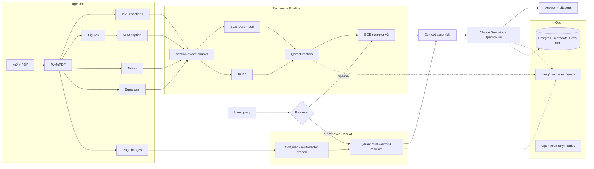

# Multi-modal Paper RAG

> A production-grade RAG system for scientific papers (ArXiv ML corpus) that
> compares **visual document retrieval (ColQwen2)** against a **multi-modal
> pipeline (text + figure captioning + table extraction)** on the same
> corpus, wrapped in a full LLMOps stack.

The headline is the comparison itself, evaluated with a QASPER-style golden
set under regression gates. The secondary story is the production engineering:
provider abstraction, prompt versioning, hybrid retrieval, eval harness,
observability, IaC, CI/CD.

This README is the entry point for running the project. Architectural
decisions live in [`docs/decisions/`](./docs/decisions/) (ADRs); the eval
framework is documented in [`docs/evals.md`](./docs/evals.md).

---

## Architecture



---

## Status

| Capability | Scope | Status |
|---|---|---|
| Text retrieval baseline | BM25 + dense + RRF + BGE rerank, generator, RAGAS-style judge | ✅ shipped (`baseline.json` = `7b5242df5b38`) |
| Figure + table extraction | PyMuPDF figures + tables → chunks | ✅ accepted, opt-in via `--extract-figures --extract-tables` |
| VLM captioning | Vision-LM captions for figures (recommended `minicpm-v:8b`) | ✅ accepted, opt-in via `--vlm-caption-model` |
| Query expansion | LLM rewrite / HyDE / combo with RRF fusion | ❌ rejected default-off; per-query wins kept in tree |
| Visual retrieval | ColQwen2 multi-vector + late-interaction MaxSim | ✅ accepted as complementary path (`scripts/eval_visual.py`) |
| Hybrid text + visual fusion | Offline RRF over text+visual at page granularity, golden v3 | ✅ measured; rejected as default — figure/table subset shows +1.9% nDCG@5, motivating routing |
| Per-query routing | Route by query category (text-only vs hybrid) per ADR 0008 | ✅ shipped (run `6447247ef8e7` — hybrid-routed figure+table queries 0.876 nDCG@5 vs 0.732 on text-routed factual/equation; routing dispatches correctly per category) |
| Multi-modal in `/answer` + regression gate | Visual leg + LLM classifier wired into the lifespan handler behind `RAG_ENABLE_MULTIMODAL`; MMLongBench retrieval baseline committed | ✅ shipped (`baseline-mmlongbench.json` = `cc45831697b6`, recall@10 0.7469 over 107 scoreable queries; gate fails when text-only is the candidate at -9.18%) |
| Production polish | Terraform / Azure Container Apps / OTel / Sentry | 🟡 scaffold landed; first apply pending |

ADRs cover every non-obvious decision in [`docs/decisions/`](./docs/decisions/).

---

## Quickstart

Prerequisites: Python 3.12, [uv](https://docs.astral.sh/uv/), Docker + Docker Compose.

```bash
git clone <repo-url> multi-modal-paper-rag
cd multi-modal-paper-rag
uv sync --extra dev
cp .env.example .env                        # fill in RAG_OPENROUTER_API_KEY (used by /answer)
docker compose up -d qdrant postgres langfuse ollama
docker exec rag-ollama ollama pull bge-m3   # one-off
```

Ingest the demo corpus — 20 arXiv ML papers in `data/papers/` (idempotent;
skips when the collection is already populated):

```bash
uv run python -m scripts.bootstrap_corpus --pdf-dir data/papers
```

Then start the API:

```bash
uv run uvicorn src.api.main:app --reload --port 8000
```

Verify in a browser at <http://localhost:8000/> — the bundled UI is BYOK
(paste your own OpenRouter key in the field, never sent to this server). It
calls `/query` for retrieval, then dispatches the chat call directly from
your browser to OpenRouter. When `RAG_PAGES_DIR` points to a populated
directory (run `python -m scripts.render_pages --pdf-dir data/papers` once
to fill it), the UI also attaches page PNGs as image content blocks so
vision-capable models (gpt-4o, claude-sonnet-4.x, qwen3-vl) read pixels
directly.

Smoke-test the API:

```bash
curl http://localhost:8000/health
curl -X POST http://localhost:8000/answer \
    -H 'Content-Type: application/json' \
    -d '{"text": "What is the inter-basin gain criterion?", "top_k": 5}'
```

The deployed image (CI-baked from `data/curated_demo/papers.txt`) bundles
`qdrant_local/` + `data/pages/` so the running container has no external
service dependency. The same `Dockerfile` works locally — point
`bootstrap_corpus` at `path:./qdrant_local` and `docker build .` if you
want to package your own corpus for elsewhere.

`/answer` returns 503 until both the OpenRouter key is set AND `bootstrap_corpus.py`
has populated Qdrant — those are the two prerequisites the lifespan handler
checks at startup. OpenAPI / Swagger UI lives at `/docs`.

---

## Bring your own PDFs (local)

The hosted demo (when live) runs against the same curated 20-paper corpus
that's baked into the Docker image. To run the same pipeline against your
own documents, point `bootstrap_corpus.py` at any directory of `.pdf` files
and tell the API to read from a different collection:

```bash
mkdir -p mydocs                  # drop your .pdf files here
uv run python -m scripts.bootstrap_corpus \
    --pdf-dir ./mydocs \
    --collection my_corpus
```

Then in `.env`:

```
RAG_CORPUS_COLLECTION=my_corpus
```

Restart `uvicorn` and your PDFs are queryable via `/query`, `/answer`, and
the bundled UI. The whole eval harness (`scripts/run_eval.py`,
`scripts/check_regression.py`) also works against any collection — write a
golden YAML at `data/golden/<name>.yaml` and pass `--golden …`.

For the visual retrieval leg (ColQwen2 + page-image generation), render the
pages once and flip the multi-modal flag:

```bash
uv run python -m scripts.render_pages --pdf-dir ./mydocs --out-dir data/pages
```

```
RAG_ENABLE_MULTIMODAL=true
RAG_PAGES_DIR=data/pages
```

The visual leg needs a CUDA GPU (~7 GB VRAM for `vidore/colqwen2-v1.0`).
Without one, leave `RAG_ENABLE_MULTIMODAL=false` (the default) — the text
retriever still works; you lose the visual lift on figure/table-heavy
queries documented in *Eval Results* below.

---

## Common issues

The top setup gotchas, observed across ColPali / Ollama / Qdrant issue
trackers:

- **`PDFInfoNotInstalledError: poppler not installed`** — `pdf2image`
  shells out to poppler. Linux: `apt install poppler-utils`. macOS:
  `brew install poppler`. Windows: download from
  [oschwartz10612/poppler-windows](https://github.com/oschwartz10612/poppler-windows)
  and add the `bin/` dir to `PATH`.
- **`model 'bge-m3' not found, try pulling it first`** — Ollama hasn't
  pulled the embedding model. `docker exec rag-ollama ollama pull bge-m3`
  (or `ollama pull bge-m3` if Ollama is outside compose).
- **`Wrong input: Vector dimension error: expected 1024, got 768`** — the
  Qdrant collection was created with a different embedder. Drop + re-ingest:
  `bootstrap_corpus.py --pdf-dir … --force`.
- **`torch.cuda.OutOfMemoryError` from ColQwen2** — the visual leg is
  multi-vector and memory-heavy. Disable with `RAG_ENABLE_MULTIMODAL=false`,
  or run on a GPU with ≥12 GB VRAM. CPU fallback works but is too slow for
  interactive use.

---

## Development

```bash
uv run ruff check .          # lint
uv run ruff format .         # format
uv run mypy src tests        # type check (strict)
uv run pytest -v             # unit tests
```

CI runs the same four checks on every push and PR — see `.github/workflows/ci.yml`.

To run the same gates locally before every push (plus a gitleaks secret scan
via Docker), enable the in-tree pre-push hook once per clone:

```bash
git config core.hooksPath .githooks
```

The hook lives at `.githooks/pre-push`; bypass with `git push --no-verify`
when needed.

---

## Project layout

Top-level packages:

- `src/types/` — Pydantic models shared across modules
- `src/config/` — Pydantic Settings + YAML defaults
- `src/llm/` — `LLMClient` Protocol and OpenRouter implementation
- `src/embeddings/` — `Embedder` Protocol and Ollama BGE-M3 implementation
- `src/api/` — FastAPI app: `/health`, `/query` (hybrid retrieval), `/answer`
  (retrieve + generate, X-API-Key gated, rate-limited at 10/min, OTel + Langfuse
  traced). Generator + retriever auto-wire from settings via the lifespan handler.
- `web/` — single-file static frontend (`index.html`, vanilla HTML/JS, no build
  step). FastAPI mounts it at `/` so the same container serves both UI and API.
- `src/ingestion/`, `src/rag/`, `src/prompts/`, `src/eval/`, `src/guardrails/`,
  `src/observability/` — heavier modules; design history in ADRs.

---

## Eval results

### Why multi-modal? — one concrete example

`mmlb_0008` from MMLongBench-Doc, paper `2310.05634v2`, gold page 8:

> *"In figure 5, what is the color of the line that has no intersection with any other line?"*  → expected answer: **red**

| Stack | top-10 retrieved pages | recall@10 |
|---|---|---|
| text-only (`589f7269d617`) | `[25, 23, 24, 94, 16, 35, 4]` | **0.00** |
| router (`cc45831697b6`) | `[25, 5, 23, 12, 24, 8, 94, 16, 15]` | **1.00** |

This is the kind of question that's fundamentally unanswerable from
extracted text — the answer lives in the chart's colour-coding. The
text retriever can't surface page 8 because the relevant signal was
never in the text layer; the visual leg (ColQwen2 multi-vector +
late-interaction MaxSim on the rendered page image) recovers it.
6 more queries with the same shape are listed in the output of
`scripts/find_visual_wins.py` (chart colours, figure-internal labels,
screenshot content, news-image identification — all cases where the
text layer of the PDF doesn't carry the answer).

**The honest tradeoff.** Multi-modal retrieval helps when figures
encode information as pixels — chart colours, layout geometry,
screenshot content, image-only diagrams. It helps less when figures
encode information as a text layer the PDF parser can extract — most
modern arXiv preprints serialise even figure-internal labels and
captions as selectable text, which is why golden v3's per-query router
showed only +1.9 % on figure subsets while MMLongBench shows +15.3 %
on the same category. ADR 0007 + `docs/decisions/0008` explain the
mechanism; the `mmlb_*` numbers below are the empirical case.

**The generation gap (closed).** When the visual leg surfaces the
right page, a text-only generator still cannot read the page image —
it answers *"Not stated in the provided context."* on `mmlb_0008` and
friends. We measured this directly:
[`scripts/experiment_mmlb_gen.py`](./scripts/experiment_mmlb_gen.py) runs the
same 106 in-corpus MMLongBench queries through `gpt-4o-mini` (text-only)
vs `qwen/qwen3-vl-32b-instruct` (vision) with **identical context** —
gold-evidence page text fed to both, plus the rendered page PNGs as
additional content blocks for the vision model.

| Aggregate (n=106) | text `gpt-4o-mini` | vision `qwen3-vl-32b` | Δ rel |
|---|---|---|---|
| **gold-answer match** | 0.330 | **0.623** | **+89 %** |
| answer_relevance | 0.612 | 0.906 | +48 % |
| faithfulness | 0.597 | 0.609 | +2 % (judge-bug bound) |

Per-category, vision lift scales with how visual the category is — the
right shape, not a uniform-everywhere preference:

| category | n | text gold-match | vision gold-match | Δ abs |
|---|---|---|---|---|
| factual | 8 | 0.75 | 0.88 | +0.12 |
| **figure** | **75** | **0.27** | **0.61** | **+0.35** |
| table | 23 | 0.39 | 0.57 | +0.17 |

**Why faithfulness stays flat.** The judge prompt sees only the text
context. When vision answers *"the line is red"* (correct, gold-matched)
and "red" isn't in the page text, the judge flags the claim unsupported.
Programmatic gold-answer match bypasses this judge bias and is the
channel to trust — it's a deterministic substring check against
MMLongBench's expert-annotated gold answers.

Run JSON: `data/eval/runs/exp_mmlb_gen_full.json`. Smoke-test design
(7 visual-only queries first, full 106 only after the smoke confirmed
the effect): `data/eval/runs/exp_mmlb_gen_smoke.json`. The smoke pre-
registered the prediction that vision would win on the seven queries
where the answer literally lives in pixels (chart colour, screenshot
content, image identification) — 5/7 vision wins, 0/7 text wins,
2/7 ties.

**The dispatch gap (closed).** The retrieval section above flagged that
the regex classifier dispatched only 26 / 149 MMLongBench queries to
hybrid where 98 were figure/table-evidenced — a 75 % under-fire on a
corpus where natural-language questions don't say "Figure X" / "Table
N". `src/rag/retrievers/classifier_llm.py` adds an LLM zero-shot
classifier as an alternative to the regex.
[`scripts/exp_classifier_dispatch.py`](./scripts/exp_classifier_dispatch.py)
ran both over the same 149 queries:

| | regex (ADR 0008) | LLM (gpt-4o-mini) | Δ abs |
|---|---|---|---|
| any → hybrid | 17.4 % | **71.8 %** | **+54 pp** |
| figure → hybrid (n=76) | 25 % | **87 %** | **+62 pp** |
| table → hybrid (n=24) | 12 % | 50 % | +38 pp |

The LLM over-dispatches some factual queries (0 % → 56 %) but the
fail-safe is bounded: hybrid retrieval on a text-only-needed query
just costs more compute, the answer is still correct.

**Composed pipeline — end-to-end win.** Three lifts compose into a
single deployed answer:
1. **Visual retriever** (ColQwen2 in `RoutingRetriever`): +9.6 %
   recall@10 aggregate, +15.3 % on figure subset.
2. **LLM classifier** (`LLMQueryClassifier`, opt-in via `classifier=`
   on RoutingRetriever): dispatches 87 % of figure queries to hybrid
   vs the regex's 25 %.
3. **Vision generator** (`Generator(pages_dir=...)` with a
   vision-capable model): +89 % gold-match on figure-grounded queries
   when it actually fires.

Each layer's lift was measured in isolation; the dispatch upgrade closes
the bottleneck that was previously suppressing the composed product.

---

Golden v2 — 5 papers, 23 queries (17 in-corpus). Production stack:
BM25 + dense + RRF → BGE-v2-m3 cross-encoder rerank → qwen2.5:7b
generate + judge.

| Metric | Value |
|---|---|
| nDCG@5 (in-corpus macro) | 0.7214 |
| recall@10 (in-corpus macro) | 0.9412 |
| MRR (in-corpus macro) | 0.7437 |
| citation grounding | 1.0000 |
| faithfulness (LLM judge) | 0.8587 |
| answer relevance (LLM judge) | 0.8261 |
| context precision (LLM judge) | 0.6304 |
| p50 whole-query latency | ~73 s |
| p50 rerank stage on GPU | ~5.5 s |

CI regression gate fails the build if any metric drops by > 5%
(`scripts/check_regression.py`).

Corpus-expansion follow-up — golden v3 (39 queries, 20 papers, retrieval-only):

| Stack | nDCG@5 | recall@10 | MRR |
|---|---|---|---|
| text @ page (chunks → page granularity) | **0.8628** | 1.0000 | **0.8167** |
| visual (ColQwen2-v1.0 only) | 0.6780 | 0.9677 | 0.6637 |
| hybrid (RRF text + visual at page level) | 0.8226 | 1.0000 | 0.7826 |

The split that motivates per-query routing: on the 14 figure/table-targeted
queries (q24–q39 in-corpus), hybrid edges text @ page (+1.9% nDCG@5);
on the 17 definitional v2 queries, hybrid loses (−10.6%).
Full analysis in
[`docs/decisions/0007-phase31-corpus-expansion-and-hybrid-fusion.md`](./docs/decisions/0007-phase31-corpus-expansion-and-hybrid-fusion.md).

Per-query router — golden v3, retrieval-only with `--rerank --router`
(run `6447247ef8e7`, ADR 0008):

| Routed category | n | mean nDCG@5 | path |
|---|---|---|---|
| equation | 1 | 1.000 | text-only |
| factual | 13 | 0.712 | text-only |
| **figure** | **11** | **0.876** | **hybrid (RRF page-level)** |
| **table** | **4** | **0.875** | **hybrid (RRF page-level)** |
| multi_hop | 2 | 0.619 | hybrid |
| out_of_corpus | 8 | 0.000 | (correct — no relevant chunks) |
| **Aggregate (in-corpus n=31)** | | **0.7942** | mixed |

The router fires hybrid for `figure`/`table`/`multi_hop` and stays
text-only for `factual`/`definitional`/`equation`, exactly per the
ADR 0007 §"Implications" oracle. Hybrid-routed figure+table queries
score 0.876 mean — well above the chunk-level text baseline. Text-routed
factual queries score 0.712 — within noise of the chunk-level baseline
0.7214 from `baseline.json`. Aggregate 0.7942 is below ADR 0007's
all-page-level numbers because the router mixes granularities (chunk-
level for text-only, page-level for hybrid); the per-category numbers
are the apples-to-apples comparison.

### Stress test on MMLongBench-Doc

Golden v3 is too easy to differentiate text vs hybrid generation —
PyMuPDF's text-layer extraction captures even figure-internal labels
on modern arXiv PDFs, so caption text is nearly always sufficient.
[MMLongBench-Doc](https://arxiv.org/abs/2407.01523) is the harder
regime: 47-page PDFs with 22.5 % unanswerable queries (refusal-gate
friendly), GPT-4o tops out at 44.9 % F1 — a non-saturated benchmark.

20 docs / 149 queries (76 figure + 24 table + 9 factual + 40 OOC),
page-level scoring. Both runs use BGE-rerank + gpt-4o-mini for
generation and as judge.

| | text-only `589f7269d617` | router `cc45831697b6` | Δ rel |
|---|---|---|---|
| **Retrieval** (n=111 in-corpus) | | | |
| nDCG@5 | 0.5904 | 0.6177 | +4.6 % |
| recall@10 | 0.6854 | **0.7515** | **+9.6 %** |
| MRR | 0.5741 | 0.6009 | +4.7 % |
| **figure subset** (n=75) | | | |
| nDCG@5 | 0.5161 | 0.5565 | +7.8 % |
| recall@10 | 0.6378 | **0.7356** | **+15.3 %** |
| **Generation** (post judge-bug fix, all 149) | | | |
| faithfulness | 0.5990 | 0.6074 | +1.4 % |
| answer_relevance | 0.6812 | 0.6879 | +1.0 % |
| context_precision | 0.4315 | 0.4369 | +1.3 % |

The visual leg's lift on figure-subset recall@10 (+15.3 %) is the
clean win that golden v3 couldn't show. Generation deltas are small
because the bottleneck is the gpt-4o-mini-as-judge can't reliably
distinguish quality at this resolution (and systematically under-
scores OOC refusals — a 15-query post-processing pass corrects the
canonical-refusal-rubric mis-grading; raw faithfulness was 0.50/0.51
before the fix).

Diagnostic that points at the next ADR. The router dispatched **only
26 of 149 queries to hybrid** even though our golden labels 98 of
them as figure/table-evidenced. Reason: MMLongBench questions are
phrased as natural language ("What's the percentage of people who…")
without the explicit "Figure X" / "Table N" keywords ADR 0008's
regex classifier looks for. Table queries hit 0 hybrid dispatches —
that's why the table-per-category metrics are identical across the
two runs. **Oracle dispatch** (route from evidence_sources rather
than query text) would have lifted hybrid coverage from ~17 % to
~66 % — likely a much bigger Δ than what we observe. This motivated
the LLM zero-shot classifier upgrade documented above ("The dispatch
gap (closed)"); see also
[`docs/decisions/0008-phase32-routing.md`](./docs/decisions/0008-phase32-routing.md).

### Multi-modal regression gate

The MMLongBench router run is committed as
[`data/eval/baseline-mmlongbench.json`](./data/eval/baseline-mmlongbench.json)
so future changes can't silently lose the +9.6 % recall@10 win. The eval
runner stores chunk-level scores against `relevant_chunk_ids` (always 0.0
for MMLongBench, since the golden uses page-level relevance). Page-level
scoring lives in
[`scripts/rescore_mmlb_pages.py`](./scripts/rescore_mmlb_pages.py); the
committed baseline is its output.

To check a candidate run against the gate:

```sh
.venv/Scripts/python.exe -m scripts.rescore_mmlb_pages \
    --run data/eval/runs/run-XXXX.json \
    --golden data/golden/mmlongbench-v1.yaml \
    --output /tmp/candidate-rescored.json
.venv/Scripts/python.exe -m scripts.check_regression \
    --baseline data/eval/baseline-mmlongbench.json \
    --candidate /tmp/candidate-rescored.json \
    --metrics ndcg_at_5 recall_at_10 mrr
```

The gate fails if any retrieval metric regresses > 5 %. Verified locally:
running it with the **text-only** run as candidate fails with `recall_at_10
delta -9.18 %` — exactly the regression we'd see if a future change
disabled the visual leg. CI doesn't run MMLongBench (it needs Qdrant +
Ollama + 15 min of compute); this is a manual gate, run before merging
any change that touches retrieval. The baseline numbers (107 queries with
both an in-corpus category label AND a non-empty `relevant_pages`) differ
slightly from the headline table above because that table uses the wider
"any query with relevant_pages" filter (111 queries) — the gate's
methodology is the stricter one and matches what `check_regression.py`
computes.

---

## License

MIT.
