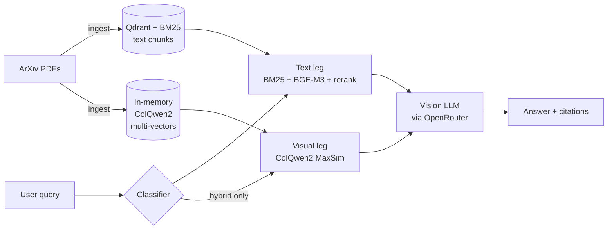

# PrismRAG

> Ask questions about PDF documents, including the ones whose
> answers live in figures, charts, and tables. The pipeline routes
> each query to text retrieval, image retrieval, or both, and every
> tradeoff is measured against committed eval baselines.

[](https://github.com/NorthernLightx/prismrag/actions/workflows/ci.yml)
[](https://github.com/NorthernLightx/prismrag/actions/workflows/docker.yml)
[](https://github.com/NorthernLightx/prismrag/actions/workflows/security.yml)
[](https://www.python.org/downloads/release/python-3120/)
[](./LICENSE)

**▶ Live demo: <https://prismrag-ar6wxit42a-ew.a.run.app>**

Most PDFs carry information a text extractor can't see: chart
colours, plot geometries, screenshots, image-only diagrams. Ask a
text-only RAG system *"In Figure 5, what colour is the line that
has no intersections?"* about an arXiv paper and it will tell you
the answer isn't in the context. It's right. The colour lives in
the pixels of the chart, not in the text layer of the PDF.

So the project pairs a text retriever with a visual one, lets a
per-query classifier pick the backend, and feeds page images to a
vision LLM at generation time. On MMLongBench-Doc the router lifts
recall@10 by **+9.6 %** overall and **+15.3 %** on figure-grounded
queries against a text-only baseline.

The eval corpora here are scientific documents (arXiv preprints and
MMLongBench-Doc), but the pipeline is document-agnostic. Point
`bootstrap_corpus.py` at any directory of `.pdf` files and the same
ingest → classify → retrieve → generate path runs against your
corpus.

## Contents

- [Headline results](#headline-results)
- [Quickstart](#quickstart)
- [How it works](#how-it-works)
- [Features](#features)
- [Limitations](#limitations)
- [Bring your own PDFs](#bring-your-own-pdfs)
- [Troubleshooting](#troubleshooting)
- [Development](#development)
- [Documentation](#documentation)
- [Project layout](#project-layout)
- [Built with](#built-with)
- [FAQ](#faq)
- [License](#license)

## Headline results

Stress-tested on [MMLongBench-Doc](https://arxiv.org/abs/2407.01523):
20 docs, 149 queries, page-level scoring, gpt-4o-mini for both
generation and judge.

| Stack | recall@10 | figure-subset recall@10 |
|---|---|---|
| text-only | 0.6854 | 0.6378 |
| **router (text + visual)** | **0.7515** | **0.7356** |
| Δ rel | **+9.6 %** | **+15.3 %** |

The lift comes from three places. ColQwen2 multi-vector retrieval
adds **+9.6 %** recall@10. An LLM zero-shot dispatcher adds
**+54 pp** of hybrid coverage on figure queries the regex baseline
wouldn't route. And a vision-capable generator (e.g. `qwen3-vl-32b`)
adds **+89 %** gold-answer match on figure-grounded queries; once
the right page is in context, a text-only model still can't read it.

Full methodology, per-category breakdowns, and five curated failure
modes are in [`docs/results.md`](./docs/results.md). Committed
baselines live under [`data/eval/`](./data/eval/), and CI fails the
build if any retrieval metric regresses by more than 5 %.

## Quickstart

```bash
git clone https://github.com/NorthernLightx/prismrag
cd prismrag
uv sync --extra dev
cp .env.example .env
docker compose up -d qdrant postgres langfuse ollama
docker exec rag-ollama ollama pull bge-m3

uv run python -m scripts.bootstrap_corpus --pdf-dir data/papers
uv run uvicorn src.api.main:app --reload --port 8000
```

Edit `.env` and set `RAG_OPENROUTER_API_KEY` if you want the server-side
`/answer` endpoint to work. The browser BYOK UI at `/` and `/chat.html`
doesn't need a server key — yours stays in your browser.

Then open one of:

- <http://localhost:8000/> for the single-shot search UI
- <http://localhost:8000/chat.html> for the conversational variant
  (per-turn fresh retrieval, plus a condense step on follow-ups)

Both share a light/dark theme toggle. Paste your own OpenRouter key
into the UI; **the key stays in your browser**. The page calls
`/query` on this server for retrieval and dispatches the chat call
directly to OpenRouter, so the server never proxies, logs, or stores
keys.

Vision-capable models (`gpt-4o`, `claude-sonnet-4.x`, `qwen3-vl`)
read page PNGs as image content blocks when `RAG_PAGES_DIR` is set.
Populate it with `python -m scripts.render_pages --pdf-dir data/papers`.

API endpoints:

- `/health`: component-wiring gate (lifespan handler)
- `/query`: retrieval only, no generation
- `/answer`: direct (non-BYOK) generation. Returns 503 until both an
  OpenRouter key and a populated Qdrant collection are present.

## How it works



1. **Ingest.** Two passes per PDF. Text is chunked section-aware
   and indexed twice: BGE-M3 dense vectors in Qdrant, BM25 sparse
   index in process. Pages are rendered to PNG on disk
   (`RAG_PAGES_DIR`), and ColQwen2 embeds each page into a
   multi-vector tensor held in memory.
2. **Classify.** For each query, decide text-only or hybrid. The
   regex baseline catches obvious figure/table mentions; the
   opt-in LLM zero-shot router catches the ones that don't say
   "Figure 5" out loud.
3. **Retrieve.** The text leg (BM25 + BGE-M3 dense + RRF +
   BGE-rerank-v2-m3) always fires. The visual leg
   (ColQwen2 + late-interaction MaxSim over page renders) fires
   only on hybrid routes.
4. **Generate.** A vision-capable LLM (`gpt-4o`, `claude-sonnet-4.x`,
   `qwen3-vl`) reads the retrieved chunks and their page PNGs as
   image content blocks, then returns an answer with chunk-level
   citations.

Eval runs offline. `scripts/eval_run.py` replays the same
retrieval and generation against a golden YAML and asks an LLM
judge to score the answers; CI's regression gate
(`scripts/check_regression.py`) fails the build if any metric
drops by more than 5 %.

The ADRs under [`docs/decisions/`](./docs/decisions/) cover the
per-decision rationale: contextual retrieval, multi-modal chunks,
hybrid fusion, the OOC refusal gate, the cost–quality cascade, and
figure-caption aggregation.

## Features

- **Browser BYOK generation**: visitors paste their own OpenRouter
  key; the call goes browser-direct and the server never sees it
- **Eval framework**: golden YAMLs, retrieval and generation metrics,
  LLM-as-judge, committed baselines, CI regression gate
- **Production polish**: FastAPI + StaticFiles, OpenTelemetry, Sentry
  and Langfuse hooks, GitHub Actions CI/CD (lint, typecheck, tests,
  container build), Cloud Run deploy via Workload Identity Federation
- **Demo-UI knobs**: an Advanced panel on the Chat and Single-shot
  pages can force the retrieval route, toggle intent vs cascade
  routing, set top-K, and filter by paper. The response meta shows
  the routing decision the server actually picked.
- **Figure browser** (`/figures.html`): catalogue of every figure-kind
  chunk in the corpus, with bbox-highlighted thumbnails and caption
  search. Handles the "show me figures" *browse* intent that
  retrieval was never designed for — separate from question answering
  via `/query` and `/answer`

## Limitations

- **Visual retrieval needs a CUDA GPU.** The hosted demo runs
  CPU-only on Cloud Run, so visual *retrieval* is disabled there
  and only the text leg fires. Local users with a CUDA GPU get the
  full routing behaviour shown in *How it works*.
- **Generation is BYOK.** Visitors paste their own OpenRouter API
  key into the UI and calls go browser-direct; the server doesn't
  proxy or store keys. The server-side `/answer` endpoint therefore
  returns 503 on the hosted demo by design: a public, unauthenticated
  endpoint shouldn't carry a shared LLM key, so generation runs through
  the browser instead. The demo still supports vision *generation*
  through this path: if the visitor picks a vision-capable model
  (`gpt-4o`, `claude-sonnet-4.x`, `qwen3-vl`), the page PNGs
  returned by retrieval are sent to OpenRouter as image content
  blocks. No key in the UI, no generation.
- **Curated 20-paper demo corpus.** The hosted demo has no upload
  feature. Local users bring their own PDFs; see *Bring your own
  PDFs* below.
- **LLM-as-judge has a known bias.** Faithfulness is systematically
  underrated when the answer lives in pixels (e.g. *"the line is
  red"*, where the judge sees only text). MMLongBench-Doc
  gold-answer match is the channel to trust.
- **Scale-to-zero.** Demo `min-instances=0` means the page loads fast
  after idle, but the first query waits while the model and index load
  in the background; the UI shows a warm-up notice and retries until
  it's ready.

## Bring your own PDFs

The hosted demo runs against the curated 20-paper corpus baked into
the container image. Locally, point `bootstrap_corpus.py` at any
directory:

```bash
mkdir mydocs                                # drop your .pdf files here
uv run python -m scripts.bootstrap_corpus \
    --pdf-dir ./mydocs --collection my_corpus
```

Set `RAG_CORPUS_COLLECTION=my_corpus` in `.env`, restart `uvicorn`,
and your PDFs are queryable through `/query` and the UI. The eval
harness (`scripts/eval_run.py`, `scripts/check_regression.py`) works
against any collection; write a golden YAML at
`data/golden/<name>.yaml`.

For the visual retrieval leg (CUDA GPU, ~7 GB VRAM):

```bash
uv run python -m scripts.render_pages --pdf-dir ./mydocs --out-dir data/pages
```

```
RAG_ENABLE_MULTIMODAL=true
RAG_PAGES_DIR=data/pages
```

## Troubleshooting

- **First sanity check: hit `/health`.** A healthy reply looks
  like:

  ```json
  {
    "status": "ok",
    "version": "0.1.0",
    "env": "local",
    "pages_available": true
  }
  ```

  `pages_available: false` means `RAG_PAGES_DIR` isn't set or
  doesn't point to a directory; the BYOK UI then sends text-only
  chat completions without attaching page PNGs. If `/health`
  doesn't respond at all, start there. None of the bullets below
  will help.
- **`PDFInfoNotInstalledError: poppler not installed`.** `pdf2image`
  shells out to poppler. Linux: `apt install poppler-utils`. macOS:
  `brew install poppler`. Windows: download from
  [oschwartz10612/poppler-windows](https://github.com/oschwartz10612/poppler-windows)
  and add `bin/` to `PATH`.
- **`model 'bge-m3' not found`.** Ollama hasn't pulled the embedding
  model. Run `docker exec rag-ollama ollama pull bge-m3`.
- **`Vector dimension error: expected 1024, got 768`.** The Qdrant
  collection was created with a different embedder. Drop and
  re-ingest: `bootstrap_corpus.py --pdf-dir … --force`.
- **`torch.cuda.OutOfMemoryError` from ColQwen2.** Disable with
  `RAG_ENABLE_MULTIMODAL=false`, or run on a GPU with ≥12 GB VRAM.

## Development

```bash
uv run ruff check . && uv run ruff format --check .
uv run mypy src tests scripts          # strict
uv run pytest -v                       # full suite (unit + integration)
```

CI runs the same set on every push and PR. To run them locally
before each push (plus a gitleaks Docker scan), enable the in-tree
pre-push hook once per clone:

```bash
git config core.hooksPath .githooks
```

Local setup, commit conventions, and the "what NEVER goes in a
commit" rules are in [`CONTRIBUTING.md`](./CONTRIBUTING.md).

## Documentation

- [`docs/results.md`](./docs/results.md): full eval results, ablation
  tables, latency profile, curated failure modes
- [`docs/evals.md`](./docs/evals.md): the eval framework. Golden
  YAML schema, retrieval and generation metrics, LLM-as-judge wiring.
- [`docs/decisions/`](./docs/decisions/): Architecture Decision
  Records (ADRs) for every non-obvious choice
- [`CONTRIBUTING.md`](./CONTRIBUTING.md): local setup, CI parity,
  commit conventions, leakage rules
- [`SECURITY.md`](./SECURITY.md): security policy and private
  vulnerability reporting

## Project layout

```
src/        FastAPI app, retrievers, ingestion, eval, observability
scripts/    CLI entry points (bootstrap, render, eval, regression)
web/        BYOK frontend — static HTML/CSS/JS, no build step, image-baked
data/       gitignored except curated_demo/papers.txt + eval baselines
docs/       ADRs, eval methodology, results
tests/      unit + integration suites, mirrors src/ layout
```

## Built with

- **Retrieval**: [Qdrant](https://qdrant.tech/),
  [BGE-M3](https://huggingface.co/BAAI/bge-m3),
  [BGE-rerank-v2-m3](https://huggingface.co/BAAI/bge-reranker-v2-m3),
  [rank-bm25](https://github.com/dorianbrown/rank_bm25)
- **Visual retrieval**:
  [ColQwen2](https://huggingface.co/vidore/colqwen2-v1.0) (vidore)
- **PDF processing**: [PyMuPDF](https://github.com/pymupdf/PyMuPDF),
  [pdf2image](https://github.com/Belval/pdf2image) (with poppler)
- **LLM gateway**: [OpenRouter](https://openrouter.ai/) for cloud
  generation, [Ollama](https://ollama.com/) for local embeddings
- **API**: [FastAPI](https://fastapi.tiangolo.com/),
  [Pydantic v2](https://docs.pydantic.dev/),
  [uv](https://docs.astral.sh/uv/)
- **Observability**: [OpenTelemetry](https://opentelemetry.io/),
  [Sentry](https://sentry.io/), [Langfuse](https://langfuse.com/)
- **Eval benchmark**:
  [MMLongBench-Doc](https://arxiv.org/abs/2407.01523)

## FAQ

**Why not LlamaIndex or LangChain?**
Both work and would have been faster to ship. The tradeoff is
opacity: every retrieval choice (chunk size, hybrid weights, rerank
cutoff, route classifier) becomes a config knob inside someone
else's abstraction. With a framework, a +2 % recall@10 lift might
be your rerank cutoff or the framework's default chunker, and
telling which is hard. This repo measures each choice in isolation
instead: eval baselines live under `data/eval/`, ADRs explain each
call, and every metric move can be traced to a specific knob. The
retrievers conform to a small protocol if you later want to wrap
them in something off-the-shelf.

**Why visual retrieval instead of OCR-ing the figures?**
OCR turns pixels into text and retrieves over the text. That
covers figure-internal labels and captions. On modern arXiv PDFs,
PyMuPDF often already extracts these without needing OCR at all.
What OCR can't recover is everything that isn't readable as text:
chart colours, geometric layout, screenshot contents, axis
positions relative to data points. Visual retrieval over rendered
pages keeps all of that. The clearest example is `mmlb_0008` in
[`docs/results.md`](./docs/results.md): the question is *"what
colour is the line that has no intersections?"*, the gold answer
is `red`, and that fact only exists in the pixels of the chart.

**Why MMLongBench-Doc?**
The in-repo golden set (`v3`) is too easy for differentiating
text vs. visual generation; PyMuPDF captures figure-internal
labels well enough that captions alone are usually sufficient.
MMLongBench-Doc is the harder regime: 47-page documents, 22.5 %
unanswerable queries (useful for the refusal gate), and GPT-4o
tops out at ~45 % F1, so the benchmark isn't saturated yet. It's
also published, so the numbers can be cross-referenced rather than
self-reported.

## License

MIT. See [`LICENSE`](./LICENSE).
