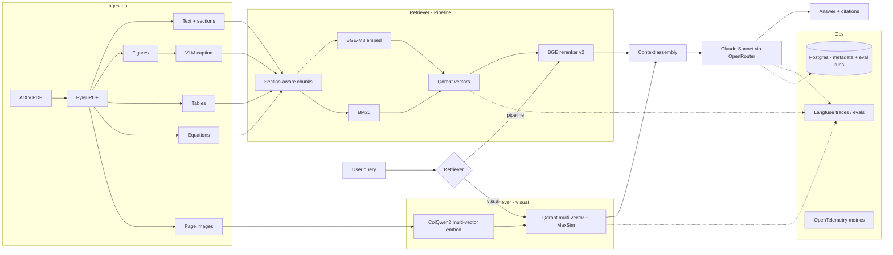

# Multi-modal Paper RAG

> A production-grade RAG system for scientific papers (ArXiv ML corpus) that
> compares **visual document retrieval (ColQwen2)** against a **multi-modal
> pipeline (text + figure captioning + table extraction)** on the same
> corpus, wrapped in a full LLMOps stack.

The headline is the comparison itself, evaluated with a QASPER-style golden
set under regression gates. The secondary story is the production engineering:
provider abstraction, prompt versioning, hybrid retrieval, eval harness,
observability, IaC, CI/CD.

This README is the entry point for running the project. Architectural
decisions live in [`docs/decisions/`](./docs/decisions/) (ADRs); the eval
framework is documented in [`docs/evals.md`](./docs/evals.md).

---

## Architecture



---

## Status

| Phase | Scope | Status |
|-------|-------|--------|
| 1 — Text-only baseline | BM25 + dense + RRF + BGE rerank, generator, RAGAS-style judge | ✅ closed (`baseline.json` = `7b5242df5b38`) |
| 2.0 — Figure + table extraction | PyMuPDF figures + tables → chunks | ✅ accepted, opt-in via `--extract-figures --extract-tables` |
| 2.1 — VLM captioning | Vision-LM captions for figures (recommended `minicpm-v:8b`) | ✅ accepted, opt-in via `--vlm-caption-model` |
| 2.2 — Query expansion | LLM rewrite / HyDE / combo with RRF fusion | ❌ rejected default-off; per-query wins kept in tree |
| 3 — Visual retrieval | ColQwen2 multi-vector + late-interaction MaxSim | ✅ accepted as complementary path (`scripts/eval_visual.py`) |
| 3.1 — Hybrid text + visual fusion | Offline RRF over text+visual at page granularity, golden v3 | ✅ closed; rejected as default — figure/table subset shows +1.9% nDCG@5, motivating routing |
| 3.2 — Per-query routing | Route by query category (text-only vs hybrid) per ADR 0008 | ✅ closed (run `6447247ef8e7` — hybrid-routed figure+table queries 0.876 nDCG@5 vs 0.732 on text-routed factual/equation; routing dispatches correctly per category) |
| 4 — Production polish | Terraform / Azure Container Apps / OTel / Sentry | 🟡 scaffold landed; first apply pending |

ADRs cover every non-obvious decision in [`docs/decisions/`](./docs/decisions/).

---

## Quickstart

Prerequisites: Python 3.12, [uv](https://docs.astral.sh/uv/), Docker + Docker Compose.

```bash
git clone <repo-url> multi-modal-paper-rag
cd multi-modal-paper-rag
uv sync --extra dev
cp .env.example .env  # fill in keys when retrieval/generation lands
docker compose up -d qdrant postgres langfuse ollama
docker exec rag-ollama ollama pull bge-m3   # one-off
uv run uvicorn src.api.main:app --reload --port 8000
```

Verify:

```bash
curl http://localhost:8000/health
```

---

## Development

```bash
uv run ruff check .          # lint
uv run ruff format .         # format
uv run mypy src tests        # type check (strict)
uv run pytest -v             # unit tests
```

CI runs the same four checks on every push and PR — see `.github/workflows/ci.yml`.

To run the same gates locally before every push (plus a gitleaks secret scan
via Docker), enable the in-tree pre-push hook once per clone:

```bash
git config core.hooksPath .githooks
```

The hook lives at `.githooks/pre-push`; bypass with `git push --no-verify`
when needed.

---

## Project layout

Top-level packages:

- `src/types/` — Pydantic models shared across modules
- `src/config/` — Pydantic Settings + YAML defaults
- `src/llm/` — `LLMClient` Protocol and OpenRouter implementation
- `src/embeddings/` — `Embedder` Protocol and Ollama BGE-M3 implementation
- `src/api/` — FastAPI app (`/health`, `/query` placeholder)

Modules added in later phases: `src/ingestion/`, `src/rag/`, `src/prompts/`,
`src/eval/`, `src/guardrails/`, `src/observability/`.

---

## Eval results

### Why multi-modal? — one concrete example

`mmlb_0008` from MMLongBench-Doc, paper `2310.05634v2`, gold page 8:

> *"In figure 5, what is the color of the line that has no intersection with any other line?"*  → expected answer: **red**

| Stack | top-10 retrieved pages | recall@10 |
|---|---|---|
| text-only (`589f7269d617`) | `[25, 23, 24, 94, 16, 35, 4]` | **0.00** |
| router (`cc45831697b6`) | `[25, 5, 23, 12, 24, 8, 94, 16, 15]` | **1.00** |

This is the kind of question that's fundamentally unanswerable from
extracted text — the answer lives in the chart's colour-coding. The
text retriever can't surface page 8 because the relevant signal was
never in the text layer; the visual leg (ColQwen2 multi-vector +
late-interaction MaxSim on the rendered page image) recovers it.
6 more queries with the same shape are listed in the output of
`scripts/find_visual_wins.py` (chart colours, figure-internal labels,
screenshot content, news-image identification — all cases where the
text layer of the PDF doesn't carry the answer).

**The honest tradeoff.** Multi-modal retrieval helps when figures
encode information as pixels — chart colours, layout geometry,
screenshot content, image-only diagrams. It helps less when figures
encode information as a text layer the PDF parser can extract — most
modern arXiv preprints serialise even figure-internal labels and
captions as selectable text, which is why golden v3's Phase 3.2 router
showed only +1.9 % on figure subsets while MMLongBench shows +15.3 %
on the same category. ADR 0007 + `docs/decisions/0008` explain the
mechanism; the `mmlb_*` numbers below are the empirical case.

**One honest gap to call out.** Even when the visual leg surfaces the
right page, the current generator is text-only and answers
*"Not stated in the provided context."* on `mmlb_0008` and friends —
it has no way to read the page image. So the visual win shows up
cleanly in retrieval metrics but not in generation metrics. Wiring a
vision-capable generator (Sonnet 4.6 vision, Qwen3-VL) into the
hybrid path is a Phase 3.2.x candidate (the spike-stage script
`scripts/spike_vision_generator.py` and follow-up experiment
`scripts/experiment_vision_vs_text.py` cover the feasibility +
golden-v3 null result; MMLongBench changes the calculus).

---

Golden v2 — 5 papers, 23 queries (17 in-corpus). Production stack:
BM25 + dense + RRF → BGE-v2-m3 cross-encoder rerank → qwen2.5:7b
generate + judge.

| Metric | Value |
|---|---|
| nDCG@5 (in-corpus macro) | 0.7214 |
| recall@10 (in-corpus macro) | 0.9412 |
| MRR (in-corpus macro) | 0.7437 |
| citation grounding | 1.0000 |
| faithfulness (LLM judge) | 0.8587 |
| answer relevance (LLM judge) | 0.8261 |
| context precision (LLM judge) | 0.6304 |
| p50 whole-query latency | ~73 s |
| p50 rerank stage on GPU | ~5.5 s |

CI regression gate fails the build if any metric drops by > 5%
(`scripts/check_regression.py`).

Phase 3.1 follow-up — golden v3 (39 queries, 20 papers, retrieval-only):

| Stack | nDCG@5 | recall@10 | MRR |
|---|---|---|---|
| text @ page (chunks → page granularity) | **0.8628** | 1.0000 | **0.8167** |
| visual (ColQwen2-v1.0 only) | 0.6780 | 0.9677 | 0.6637 |
| hybrid (RRF text + visual at page level) | 0.8226 | 1.0000 | 0.7826 |

The split that motivates Phase 3.2 routing: on the 14 figure/table-targeted
queries (q24–q39 in-corpus), hybrid edges text @ page (+1.9% nDCG@5);
on the 17 definitional v2 queries, hybrid loses (−10.6%).
Full analysis in
[`docs/decisions/0007-phase31-corpus-expansion-and-hybrid-fusion.md`](./docs/decisions/0007-phase31-corpus-expansion-and-hybrid-fusion.md).

Phase 3.2 router — golden v3, retrieval-only with `--rerank --router`
(run `6447247ef8e7`, ADR 0008):

| Routed category | n | mean nDCG@5 | path |
|---|---|---|---|
| equation | 1 | 1.000 | text-only |
| factual | 13 | 0.712 | text-only |
| **figure** | **11** | **0.876** | **hybrid (RRF page-level)** |
| **table** | **4** | **0.875** | **hybrid (RRF page-level)** |
| multi_hop | 2 | 0.619 | hybrid |
| out_of_corpus | 8 | 0.000 | (correct — no relevant chunks) |
| **Aggregate (in-corpus n=31)** | | **0.7942** | mixed |

The router fires hybrid for `figure`/`table`/`multi_hop` and stays
text-only for `factual`/`definitional`/`equation`, exactly per the
ADR 0007 §"Implications" oracle. Hybrid-routed figure+table queries
score 0.876 mean — well above the chunk-level text baseline. Text-routed
factual queries score 0.712 — within noise of the chunk-level baseline
0.7214 from `baseline.json`. Aggregate 0.7942 is below ADR 0007's
all-page-level numbers because the router mixes granularities (chunk-
level for text-only, page-level for hybrid); the per-category numbers
are the apples-to-apples comparison.

### Stress test on MMLongBench-Doc

Golden v3 is too easy to differentiate text vs hybrid generation —
PyMuPDF's text-layer extraction captures even figure-internal labels
on modern arXiv PDFs, so caption text is nearly always sufficient.
[MMLongBench-Doc](https://arxiv.org/abs/2407.01523) is the harder
regime: 47-page PDFs with 22.5 % unanswerable queries (refusal-gate
friendly), GPT-4o tops out at 44.9 % F1 — a non-saturated benchmark.

20 docs / 149 queries (76 figure + 24 table + 9 factual + 40 OOC),
page-level scoring. Both runs use BGE-rerank + gpt-4o-mini for
generation and as judge.

| | text-only `589f7269d617` | router `cc45831697b6` | Δ rel |
|---|---|---|---|
| **Retrieval** (n=111 in-corpus) | | | |
| nDCG@5 | 0.5904 | 0.6177 | +4.6 % |
| recall@10 | 0.6854 | **0.7515** | **+9.6 %** |
| MRR | 0.5741 | 0.6009 | +4.7 % |
| **figure subset** (n=75) | | | |
| nDCG@5 | 0.5161 | 0.5565 | +7.8 % |
| recall@10 | 0.6378 | **0.7356** | **+15.3 %** |
| **Generation** (post judge-bug fix, all 149) | | | |
| faithfulness | 0.5990 | 0.6074 | +1.4 % |
| answer_relevance | 0.6812 | 0.6879 | +1.0 % |
| context_precision | 0.4315 | 0.4369 | +1.3 % |

The visual leg's lift on figure-subset recall@10 (+15.3 %) is the
clean win that golden v3 couldn't show. Generation deltas are small
because the bottleneck is the gpt-4o-mini-as-judge can't reliably
distinguish quality at this resolution (and systematically under-
scores OOC refusals — a 15-query post-processing pass corrects the
canonical-refusal-rubric mis-grading; raw faithfulness was 0.50/0.51
before the fix).

Diagnostic that points at the next ADR. The router dispatched **only
26 of 149 queries to hybrid** even though our golden labels 98 of
them as figure/table-evidenced. Reason: MMLongBench questions are
phrased as natural language ("What's the percentage of people who…")
without the explicit "Figure X" / "Table N" keywords ADR 0008's
regex classifier looks for. Table queries hit 0 hybrid dispatches —
that's why the table-per-category metrics are identical across the
two runs. **Oracle dispatch** (route from evidence_sources rather
than query text) would have lifted hybrid coverage from ~17 % to
~66 % — likely a much bigger Δ than what we observe. Phase 3.2.1
candidate: classifier upgrade to LLM zero-shot or embedding-similarity
for corpora where queries don't carry their own modality cue.
See [`docs/decisions/0008-phase32-routing.md`](./docs/decisions/0008-phase32-routing.md).

---

## License

MIT.
