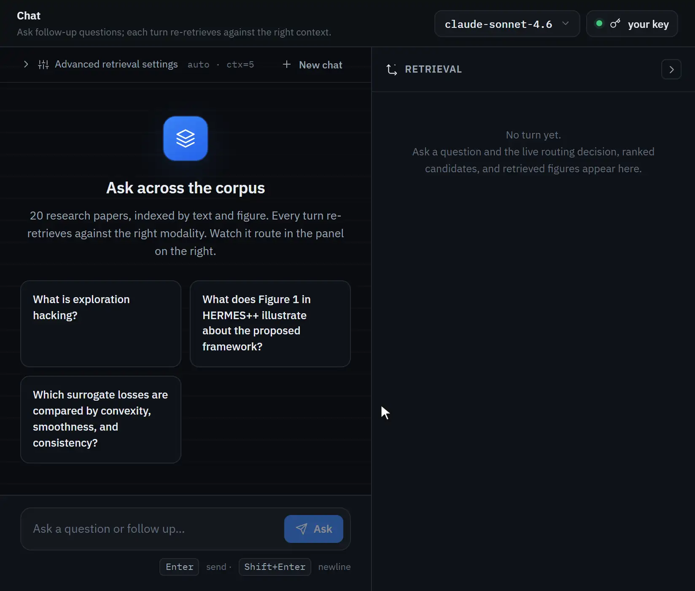
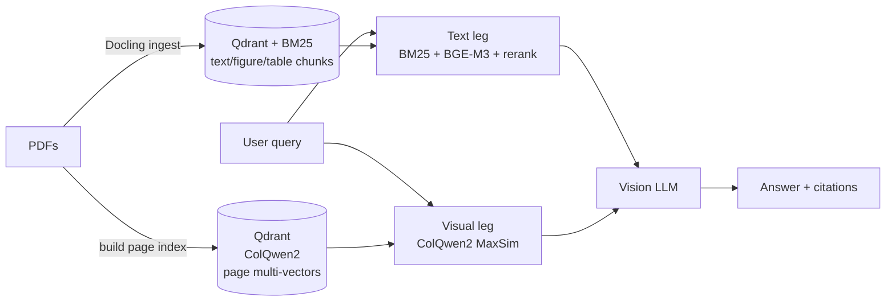

# SpectraRAG

> Question answering over PDFs whose answers live in figures, charts, and
> tables, where text-only search comes up short. Two retrievers fused on
> every question, and an eval behind every change.

[](https://github.com/NorthernLightx/spectrarag/actions/workflows/ci.yml)
[](https://github.com/NorthernLightx/spectrarag/actions/workflows/docker.yml)
[](https://github.com/NorthernLightx/spectrarag/actions/workflows/security.yml)
[](https://www.python.org/downloads/release/python-3120/)
[](./LICENSE)

**▶ Live demo: <https://spectrarag-demo.web.app>**



## The problem

A PDF's text layer is only half the document. Ask an ordinary RAG system
*"in Figure 5, what colour is the line with no intersections?"* and it will
tell you the answer isn't in the context. It's right: the colour lives in the
chart's pixels, not the text. The same blind spot covers plot geometry,
screenshots, and image-only diagrams.

SpectraRAG runs a text retriever and a visual retriever over rendered page
images on every question and fuses their results. The retrieved page images go
to a vision model at answer time. The corpus
here is scientific PDFs and MMLongBench-Doc, but nothing is domain-specific:
point the ingester at any folder of `.pdf` files.

## Result

Page-level retrieval on [MMDocIR](https://arxiv.org/abs/2501.08828): 1,127
queries over 218 documents and 4,837 pages, with page and bounding-box evidence
labels. Numbers are reported on the 1,029 queries whose documents are absent
from the older MMLongBench corpus. The metric is recall@10 over retrieved pages,
scored paper-aware (a page counts only if it is the gold paper's), so it is
independent of any generator.

| retrieval | recall@10 | median latency |
|---|---|---|
| text-only | 0.460 ±0.030 | 4,265 ms |
| classifier router | 0.621 ±0.030 | 5,860 ms |
| **text + visual on every query** | **0.784 ±0.025** | 5,843 ms |
| visual-only | 0.800 ±0.024 | 983 ms |

Running both legs beats the per-query classifier by 0.163 recall@10 at the same
median latency, so the classifier is a cost switch rather than an accuracy one.
That reversed this project's earlier conclusion, which rested on a 107-query set
too small to separate the two: [ADR 0032](./docs/decisions/0032-routing-is-a-cost-lever.md)
supersedes [0013](./docs/decisions/0013-routing-is-the-accuracy-lever.md). Three
ways the result could have been an artefact (query mix, corpus text density,
page budget) were each tested, and none of them explains it.

The earlier MMLongBench-Doc measurement stands on its own terms: over 107
in-corpus queries the router scores 0.7461 recall@10 against text-only's 0.5545,
a 35 % lift, and 0.5111 to 0.7578 on the figure subset. Those runs are committed
under [`data/eval/`](./data/eval/) as `baseline-mmlongbench-text.json` and
`baseline-mmlongbench-router.json`. The regression gate pins the larger MMDocIR
set, on the always-hybrid arm that production now serves.

**Retrieval is no longer the binding constraint. Reading is.** Handed the right
page, the reader answers roughly a third of queries correctly. Of the 110 to
120 queries whose gold page was retrieved, about 46 % were refused and 12 to 29 %
were answered wrongly (the judge's partial grades decide where in that range),
so refusal outnumbers misreading. Prompting past those
refusals lifts the coverage metric and produces more wrong answers: one variant
went from 44 wrong answers to 57 of 150. No prompt variant shipped. Full
methodology and failure modes are in [`docs/results.md`](./docs/results.md). For
how measuring the end-to-end path overturned this project's own assumptions (and
which fixes died under measurement), see
[`docs/finding-the-bottleneck.md`](./docs/finding-the-bottleneck.md).

## How it works


```mermaid
flowchart LR
    PDF[PDFs] -->|Docling ingest| TXTIDX[(Qdrant + BM25<br/>text/figure/table chunks)]
    PDF -->|build page index| VISIDX[(Qdrant<br/>ColQwen2<br/>page multi-vectors)]
    Q[User query] --> TXT[Text leg<br/>BM25 + BGE-M3 + rerank]
    Q --> VIS[Visual leg<br/>ColQwen2 MaxSim]
    TXTIDX --> TXT
    VISIDX --> VIS
    TXT --> LLM[Vision LLM]
    VIS --> LLM
    LLM --> A[Answer + citations]
```

1. **Ingest.** Each PDF goes through [Docling](https://github.com/docling-project/docling)
   for layout-aware, section-attributed text chunks plus figure and table
   extraction, with a figure-role classifier separating real figures from
   page decoration. Text, figure, and table chunks are indexed
   twice: BGE-M3 dense vectors in Qdrant and a BM25 sparse index in process.
   Pages are rendered to PNG, and ColQwen2 embeds each page into a
   multi-vector page index persisted in Qdrant (built offline; ADR 0028).
2. **Retrieve.** Both legs run on every question (ADR 0032): the text leg
   (BM25 + BGE-M3 dense + reciprocal-rank fusion + BGE-reranker-v2-m3) and the
   visual leg (ColQwen2 late-interaction MaxSim over page images), fused at
   page granularity. A per-query classifier (`gemma3:4b` zero-shot over Ollama,
   with a regex fallback) can pick one leg instead. It exists to save work,
   but on this hardware it saves none and costs recall, so it is off by default.
3. **Generate.** A vision-capable model reads the retrieved chunks and their
   page images and returns an answer with chunk-level citations.

## Quickstart

This repo is the backend and its evaluation. The [live demo](https://spectrarag-demo.web.app)
is a separate web client of the same API.

Fastest path: serve the bundled demo corpus self-contained, with no Docker or
Ollama (in-process bge-m3 + the committed Qdrant snapshot). The first run
downloads the bge-m3 weights.

```bash
git clone https://github.com/NorthernLightx/spectrarag
cd spectrarag
uv sync --extra dev
uv run spectrarag serve
```

The API serves the bundled demo corpus with text retrieval at
<http://localhost:8000>; `/docs` has the interactive reference. Query it:

```bash
curl -s localhost:8000/query -H "Content-Type: application/json" \
    -d '{"text": "What does Figure 1 in HERMES++ illustrate?", "top_k": 5}'
```

Retrieval needs no model provider. For answers with citations, set
`RAG_OPENROUTER_API_KEY` in `.env` and send the same body to `/answer`; the
model is `RAG_DEFAULT_CHAT_MODEL`. The visual leg's page index is not in the
repo: build it on a GPU with `uv run spectrarag fetch` and
`uv run python -m scripts.build_visual_index`, then set
`RAG_ENABLE_MULTIMODAL=true`. For your own PDFs, see
[Bring your own PDFs](#bring-your-own-pdfs).

For the full local stack (Docker Qdrant + Ollama, plus ingesting your own PDFs):

```bash
cp .env.example .env
docker compose up -d qdrant ollama
docker exec rag-ollama ollama pull bge-m3

# fetch the demo corpus (arXiv papers from the committed manifest), then ingest
uv run python -m scripts.fetch_papers --manifest data/curated_demo/papers.txt
uv run python -m scripts.bootstrap_corpus --pdf-dir data/papers
uv run uvicorn src.api.main:app --reload --port 8000
```

Then query <http://localhost:8000> the same way.

The opt-in agentic search (DCI) has an LLM agent grep the corpus with
terminal-style tools instead of vector search: `POST /query/dci` with your
OpenRouter key in the `X-OpenRouter-Key` header, held in memory for that
request only. It's text-only and slower, so treat it as a demo of the approach,
not the default path. `/answer` sends the retrieved page PNGs to the model as
image blocks when `RAG_PAGES_DIR` is set; populate it with
`python -m scripts.render_pages --pdf-dir data/papers`.

API surface:

- `/health`: component-wiring check (status, version, env, `pages_available`,
  and the fingerprint of the retrieval stack that was wired)
- `/query`: retrieval only, no generation. `force_route` (`text` or
  `visual`) or `routing_mode: "category"` (the classifier router) changes which
  legs run; `filters.paper_id` scopes it to one paper
- `/context`: the reader's messages for one turn, for a client that calls its
  own model provider ([ADR 0033](./docs/decisions/0033-one-reader-context.md))
- `/answer`: retrieval plus generation on the server's OpenRouter key
- `/papers`, `/figures`: the indexed corpus; `/pages/...`: page images when
  `RAG_PAGES_DIR` is set

## Bring your own PDFs

The bundled demo corpus is a fixed set of arXiv papers
(`data/curated_demo/papers.txt`). Point the ingester at any directory to
replace it:

```bash
mkdir mydocs                                # drop your .pdf files here
uv run python -m scripts.bootstrap_corpus \
    --pdf-dir ./mydocs --collection my_corpus
```

Set `RAG_CORPUS_COLLECTION=my_corpus` in `.env`, restart `uvicorn`, and the
corpus is queryable through `/query` and `/answer`. The eval harness works
against any collection; write a golden set at `data/golden/<name>.yaml`.

For a single document, set `RAG_ENABLE_UPLOAD=true` and `POST /ingest` it:
the PDF is ingested into the live corpus
and text-retrievable on the next query, no restart. Keep the flag off on any
shared deploy. The route carries no auth or rate limit of its own.

The visual leg needs a CUDA GPU to *build* the page index (ColQwen2-v1.0 fits
an 8 GB card); serving it then runs on CPU. Build the persisted index and point
the app at it:

```bash
uv run python -m scripts.build_visual_index --pdf-dir ./mydocs \
    --qdrant http://localhost:6333 \
    --corpus-collection my_corpus --collection my_corpus_visual
```

```
RAG_ENABLE_MULTIMODAL=true
RAG_VISUAL_COLLECTION=my_corpus_visual
RAG_PAGES_DIR=data/pages
```

## Evaluation

`scripts/eval_run.py` replays retrieval (and optionally generation + an LLM
judge) against a golden YAML and writes a run JSON. `scripts/check_regression.py`
is the gate: it compares a run against a committed baseline and fails on any
metric that drops more than 5 %. It pins `baseline-mmdocir-hybrid.json`, the arm
production serves. The older MMLongBench baselines need a page-level rescore
through `scripts/rescore_mmlb_pages.py` first; MMDocIR runs do not.

Every retrieval knob (chunk size, fusion weights, rerank cutoff, router
classifier) is measured in isolation, so a recall change traces to one knob
rather than a framework default. See [`docs/evals.md`](./docs/evals.md) for the golden schema and
metric definitions.

## What the evaluation found (end-to-end)

Beyond retrieval, the project pins down where end-to-end answer accuracy actually
tops out, and part of the apparent ceiling turned out to be the scorer rather than
the model.

- **It's a RAG ↔ long-context tradeoff.** Where a document fits the model's
  context, feeding the *whole* document beats a top-5 retrieval cut by ~0.12
  (tables +0.18); past context, retrieval is required. We measured both directions
  and shipped route-by-fit as an opt-in eval policy (ADR
  [0024](./docs/decisions/)). It is deliberately not wired into the corpus-wide
  demo, which would first have to identify the target document.
- **The strict scorer understated accuracy by ~0.11, and we caught it.** The
  standard extract-then-match step marks terse-but-correct answers as "Not
  answerable" (even GPT-4o does this). A strictness-checked re-grade lifts the
  oracle read from ~0.45 to ~0.55. The measured ceiling is ~0.55; the published SOTA
  is ~0.62 (whole document, full 1082-query set).
- **Scaling the model doesn't move the reading.** A 31B, a 235B, and frontier
  gemini-2.5-pro read the gold pages within a point of each other; the bottleneck
  is fine-grained figure and table reading, not model size.
- **Changing what the reader sees helps where a bigger model doesn't.** The
  bottleneck is reading figures and tables, so this lever works on the input rather
  than the model: transcribe a page's tables and charts to text offline and feed it
  to the reader alongside the page image. On the post-retrieval failure set that
  adds about 0.12, but on too few cases to call significant yet. The extractor can
  be a local 1.2B model (MinerU2.5) instead of a cloud one: it matches
  qwen3-vl-235b on extraction recall, a tie rather than a win. The backend selector
  is in place (`RAG_EXTRACTOR_BACKEND`, default off); the ingest-time path that
  would feed it to the reader waits until the result holds up
  (ADR [0025](./docs/decisions/)).
- **Negatives are measured, not assumed.** GraphRAG lost to plain RAG (ADR
  [0018](./docs/decisions/), 5-1 on global synthesis); agentic query-decomposition
  did not transfer and hurt retrieval on this corpus (ADR
  [0019](./docs/decisions/)); text rerankers were a wash (ADR
  [0012](./docs/decisions/)); and direct-corpus-interaction (a grep-tool agent) is
  off the reading bottleneck here, so it ships as an experimental opt-in, not a
  default (ADR [0026](./docs/decisions/)).

Full methodology in [`docs/results.md`](./docs/results.md). For how SpectraRAG
compares to other document-RAG tools, see
[`docs/comparison.md`](./docs/comparison.md).

## Limitations

- **The demo corpus is text-heavy.** The visual leg is on, but the baked
  arXiv set has few figure or table answers, so the visual lift you
  see here is small. The retrieval numbers above come from MMDocIR and
  MMLongBench, not from these papers.
- **Generation needs a provider.** `/answer` needs an OpenRouter key;
  retrieval works without one.
- **The LLM judge under-rates pixel answers.** When the answer is in the
  image (for example *"the line is red"*) and the judge sees only text,
  faithfulness is scored low. For generation quality, trust gold-answer
  match, not the judge.

## Development

```bash
uv run ruff check . && uv run ruff format --check .
uv run mypy src tests scripts          # strict
uv run pytest -v                       # unit + integration
```

CI runs the same set on every push and PR. To run it locally before each push
(plus a gitleaks scan), enable the in-tree hook once: `git config core.hooksPath .githooks`.
Local setup, commit conventions, and the leakage rules are in
[`CONTRIBUTING.md`](./CONTRIBUTING.md).

Common setup issues: `model 'bge-m3' not found` means Ollama hasn't pulled it
(`docker exec rag-ollama ollama pull bge-m3`); `expected 1024, got 768` means
the collection was built with a different embedder (re-ingest with `--force`);
a ColQwen2 `OutOfMemoryError` means the GPU is below ~8 GB, so disable the
visual leg with `RAG_ENABLE_MULTIMODAL=false`.

## Project layout

```
src/        FastAPI app, retrievers, ingestion, eval, observability
scripts/    CLI entry points (bootstrap, render, eval, regression)
data/       gitignored except curated_demo/papers.txt, eval baselines,
            golden sets, and the committed demo page renders
docs/       ADRs, eval methodology, results
tests/      unit + integration suites, mirrors src/
```

## Built with

- **Retrieval**: [Qdrant](https://qdrant.tech/),
  [BGE-M3](https://huggingface.co/BAAI/bge-m3),
  [BGE-reranker-v2-m3](https://huggingface.co/BAAI/bge-reranker-v2-m3),
  [rank-bm25](https://github.com/dorianbrown/rank_bm25)
- **Visual retrieval**: [ColQwen2](https://huggingface.co/vidore/colqwen2-v1.0) (vidore)
- **Document parsing**: [Docling](https://github.com/docling-project/docling)
  (layout, tables, figure classification), [PyMuPDF](https://github.com/pymupdf/PyMuPDF)
  (page rendering)
- **Models**: [OpenRouter](https://openrouter.ai/) for cloud generation,
  [Ollama](https://ollama.com/) for local generation, embeddings, and the
  routing classifier
- **API**: [FastAPI](https://fastapi.tiangolo.com/),
  [Pydantic v2](https://docs.pydantic.dev/), [uv](https://docs.astral.sh/uv/)
- **Observability**: [OpenTelemetry](https://opentelemetry.io/),
  [Sentry](https://sentry.io/), [Langfuse](https://langfuse.com/)
- **Deploy**: Cloud Run via GitHub Actions with Workload Identity Federation
- **Eval benchmarks**: [MMDocIR](https://arxiv.org/abs/2501.08828), [MMLongBench-Doc](https://arxiv.org/abs/2407.01523)

## References

Papers and benchmarks this project builds on or measures against:

- **ColPali: Efficient Document Retrieval with Vision Language Models** (Faysse
  et al., [arXiv:2407.01449](https://arxiv.org/abs/2407.01449)). The
  late-interaction visual-retrieval architecture; the deployed visual leg runs
  ColQwen2 from this line.
- **BGE M3-Embedding** (Chen et al.,
  [arXiv:2402.03216](https://arxiv.org/abs/2402.03216)). The dense and sparse
  text embeddings behind the text leg.
- **Docling Technical Report** (Auer et al., IBM,
  [arXiv:2408.09869](https://arxiv.org/abs/2408.09869)). Layout-aware PDF parsing
  for the structure-attributed chunker.
- **MMDocIR: Benchmarking Multi-Modal Retrieval for Long Documents**
  ([arXiv:2501.08828](https://arxiv.org/abs/2501.08828)). Page and
  bounding-box evidence labels over 1,127 queries; the benchmark behind the
  headline retrieval result and behind ADR 0032.
- **MMLongBench-Doc** ([arXiv:2407.01523](https://arxiv.org/abs/2407.01523)).
  The long-document multimodal benchmark behind the earlier router measurement
  and the committed regression gate.
- **BRIGHT: A Realistic and Challenging Benchmark for Reasoning-Intensive
  Retrieval** (Su et al., [arXiv:2407.12883](https://arxiv.org/abs/2407.12883)).
  Retrieval that needs reasoning rather than surface similarity; the benchmark
  the Agentic search experiment is scored on.
- **Beyond Semantic Similarity: Rethinking Retrieval for Agentic Search via
  Direct Corpus Interaction** ([arXiv:2605.05242](https://arxiv.org/abs/2605.05242)).
  The grep-the-raw-corpus agent behind the experimental Agentic search toggle
  (ADR [0026](./docs/decisions/)).

## FAQ

**Why not LlamaIndex or LangChain?**
Both would have shipped faster. The cost is opacity: every retrieval choice
becomes a knob inside someone else's abstraction, and a +2 % recall change is
hard to attribute. This repo measures each choice against a committed baseline
instead. The retrievers conform to a small protocol if you later want to wrap
them in a framework.

**Why visual retrieval instead of OCR-ing the figures?**
OCR recovers figure-internal text and captions, which PyMuPDF often already
extracts from modern PDFs. It cannot recover what isn't text: chart colours,
geometric layout, screenshot contents, axis positions relative to data. Visual
retrieval over rendered pages keeps all of that. The canonical example is
`mmlb_0008`: *"what colour is the line with no intersections?"*, gold answer
`red`, a fact that exists only in the pixels.

**Why MMLongBench-Doc?**
The in-repo golden set is too easy to separate text from visual retrieval. 
MMLongBench-Doc is the harder regime: long documents, ~22 % unanswerable
queries (useful for the refusal gate), and it isn't saturated (GPT-4o tops out
near 45 % F1). Being published, its numbers can be cross-referenced.

## License

MIT. See [`LICENSE`](./LICENSE).
