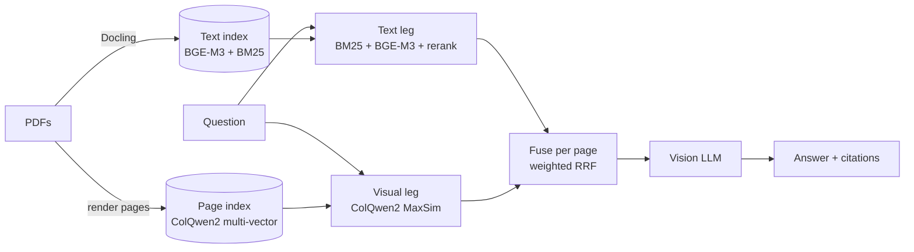

# SpectraRAG

> A multimodal RAG system for PDFs whose answers live in figures, charts, and
> tables. It searches every page as an image as well as text, and each
> retrieval setting is measured on a public benchmark.

[](https://github.com/NorthernLightx/spectrarag/actions/workflows/ci.yml)
[](https://github.com/NorthernLightx/spectrarag/actions/workflows/docker.yml)
[](https://github.com/NorthernLightx/spectrarag/actions/workflows/security.yml)
[](https://www.python.org/downloads/release/python-3120/)
[](./LICENSE)

**▶ Live demo: <https://spectrarag-demo.web.app>**


## Why

A PDF's text layer is only half the document. Ask a text-only RAG system *"in
Figure 5, what colour is the line with no intersections?"* and it answers that
the context doesn't say. It's right: the colour is in the chart's pixels, not
the text. Plot geometry, screenshots and image-only diagrams have the same
problem.

SpectraRAG indexes every page twice: as text chunks, and as a rendered image
that a late-interaction model (ColQwen2) searches directly. A vision model reads
the retrieved pages and answers with citations. Nothing is domain-specific:
point the ingester at any folder of PDFs.

## Results

Page retrieval on [MMDocIR](https://arxiv.org/abs/2501.08828), 1,029 questions
over the benchmark's long documents (the 98 questions on documents that also
appear in MMLongBench-Doc are left out). Recall counts a gold page only when it
comes from the right document, so no generator is involved.

| retrieval | recall@5 | recall@10 |
|---|---|---|
| text only | 0.415 | 0.460 |
| text and visual, fused | 0.703 | 0.788 |
| visual only | **0.753** | **0.800** |

All three rows come from one recorded run
([`data/eval/mmdocir-depth50-legs.json.gz`](./data/eval/mmdocir-depth50-legs.json.gz));
the text leg there reranks with bge-reranker-v2-m3. On these documents the
page image carries the answer, and fusing in the text leg's results costs 0.05
recall@5. On the text-heavy arXiv papers of the demo corpus the text leg ranks
figure captions better, so the balance is a setting per corpus:
`RAG_VISUAL_FUSION_WEIGHT` (1 by default; above about 1.15 the top results are
the visual leg's pages).

**Most failures happen in reading, not retrieval.** On a 150-question sample
read by `gemma-4-26b`, when the gold page was retrieved the reader refused
nearly half the time, answered about a quarter correctly, and got the rest
wrong or partly right. What else the measurements showed:

- Prompting the reader past its refusals raised the score and the wrong
  answers with it (44 to 57 of 150), so no prompt change shipped.
- A bigger reader doesn't read better. A 31B model, a 235B model and
  gemini-2.5-pro read the gold pages of MMLongBench-Doc within a point of each
  other.
- Where a document fits the model's context, feeding the whole document beats
  top-5 retrieval by about 0.12.
- Measured and not adopted: GraphRAG, agentic query decomposition, a per-query
  router that picks one retriever, a smaller 2026 visual retriever (a tie), and
  a page-image reranker that adds 0.03 recall@5 but is too slow to serve on CPU.

Method and full numbers are in [`docs/results.md`](./docs/results.md). The
design decisions, each with the measurement behind it, are in
[`docs/decisions/`](./docs/decisions/README.md).

## How it works


```mermaid
flowchart LR
    PDF[PDFs] -->|Docling| TXTIDX[(Text index<br/>BGE-M3 + BM25)]
    PDF -->|render pages| VISIDX[(Page index<br/>ColQwen2 multi-vector)]
    Q[Question] --> TXT[Text leg<br/>BM25 + BGE-M3 + rerank]
    Q --> VIS[Visual leg<br/>ColQwen2 MaxSim]
    TXTIDX --> TXT
    VISIDX --> VIS
    TXT --> FUSE[Fuse per page<br/>weighted RRF]
    VIS --> FUSE
    FUSE --> LLM[Vision LLM]
    LLM --> A[Answer + citations]
```

1. **Ingest.** [Docling](https://github.com/docling-project/docling) splits
   each PDF into section-attributed text, figure and table chunks, and a
   classifier marks page decoration so retrieval can skip it. Chunks are
   indexed as BGE-M3 vectors in
   Qdrant and in an in-process BM25 index. Pages are rendered to PNG and
   ColQwen2 embeds each one into a multi-vector page index, built offline on a
   GPU.
2. **Retrieve.** Both legs run on every question. The text leg fuses BM25 and
   BGE-M3 and reranks with a cross-encoder (MiniLM when serving on CPU). The
   visual leg scores page images with ColQwen2's MaxSim. The two are fused per
   page with weighted reciprocal-rank fusion.
3. **Answer.** A vision-capable model reads the retrieved chunks and their
   page images and answers with chunk-level citations.

## Quickstart

Serve the bundled demo corpus with no Docker or Ollama (in-process bge-m3 and
a committed Qdrant snapshot). The first run downloads the bge-m3 weights.

```bash
git clone https://github.com/NorthernLightx/spectrarag
cd spectrarag
uv sync --extra dev
uv run spectrarag serve
```

The API runs at <http://localhost:8000>, with the interactive reference at
`/docs`. Query it:

```bash
curl -s localhost:8000/query -H "Content-Type: application/json" \
    -d '{"text": "What does Figure 1 in HERMES++ illustrate?", "top_k": 5}'
```

Retrieval needs no model provider. For answers with citations, set
`RAG_OPENROUTER_API_KEY` in `.env` and send the same body to `/answer`; the
model is `RAG_DEFAULT_CHAT_MODEL`.

<details>
<summary>Turn on the visual leg</summary>

The page index is not in the repo. Build it on a CUDA GPU (ColQwen2 fits an
8 GB card), then serve on CPU:

```bash
uv run spectrarag fetch
uv run python -m scripts.build_visual_index
```

Set `RAG_ENABLE_MULTIMODAL=true`. For `/answer` to send page images to the
model, render them and set `RAG_PAGES_DIR`:

```bash
uv run python -m scripts.render_pages --pdf-dir data/papers
```

</details>

<details>
<summary>Full local stack (Docker Qdrant and Ollama)</summary>

```bash
cp .env.example .env
docker compose up -d qdrant ollama
docker exec rag-ollama ollama pull bge-m3

# fetch the demo corpus (arXiv papers from the committed manifest), then ingest
uv run python -m scripts.fetch_papers --manifest data/curated_demo/papers.txt
uv run python -m scripts.bootstrap_corpus --pdf-dir data/papers
uv run uvicorn src.api.main:app --reload --port 8000
```

</details>

## Usage

### API

| route | what it does |
|---|---|
| `GET /health` | component status and the fingerprint of the retrieval stack in use |
| `POST /query` | retrieval only; `filters.paper_id` scopes it to one paper |
| `POST /context` | the reader's messages for one turn, for a client that calls its own model |
| `POST /answer` | retrieval plus generation, on the server's OpenRouter key |
| `POST /ingest` | add one PDF to the live corpus (only with `RAG_ENABLE_UPLOAD=true`) |
| `GET /papers`, `GET /figures` | the indexed corpus |
| `GET /pages/...` | page images, when `RAG_PAGES_DIR` is set |
| `POST /query/dci` | experimental: an LLM agent greps the corpus instead of vector search (text only, your key in `X-OpenRouter-Key`) |

The live demo is a separate web client of this API.

### Your own PDFs

Point the ingester at a directory:

```bash
mkdir mydocs   # drop your .pdf files here
uv run python -m scripts.bootstrap_corpus --pdf-dir ./mydocs --collection my_corpus
```

Set `RAG_CORPUS_COLLECTION=my_corpus` in `.env` and restart. The corpus is then
queryable through `/query` and `/answer`. `POST /ingest` adds a single document
without a restart; it has no auth or rate limit, so keep `RAG_ENABLE_UPLOAD`
off on any shared deploy.

To add the visual leg for your corpus, build its page index and point the app
at it:

```bash
uv run python -m scripts.build_visual_index --pdf-dir ./mydocs \
    --qdrant http://localhost:6333 \
    --corpus-collection my_corpus --collection my_corpus_visual
```

```
RAG_ENABLE_MULTIMODAL=true
RAG_VISUAL_COLLECTION=my_corpus_visual
RAG_PAGES_DIR=data/pages
```

If answers live mostly in figures and scanned pages, try
`RAG_VISUAL_FUSION_WEIGHT=2`; for text-heavy documents keep the default.

## Evaluation

`scripts/eval_run.py` runs retrieval (and optionally generation and an LLM
judge) over a golden YAML and writes a run JSON. `scripts/check_regression.py`
compares a run with a committed baseline and fails on any metric that drops
more than 5 %.

CI runs the served stack over the demo corpus on every push: the text arm and
the fused arm against `data/eval/baseline_retrieval.json` and
`data/eval/baseline_retrieval_hybrid.json`, and it also fails if any single
query loses recall@10. The visual leg replays from a recorded fixture, since
the runner has no GPU. Golden-set schema, metrics and how to reproduce the
MMDocIR numbers are in [`docs/evals.md`](./docs/evals.md).

## Limitations

- **The demo corpus is text-heavy.** The baked arXiv set has few figure or
  table answers, so the visual leg adds little there. The numbers above come
  from MMDocIR, not from these papers.
- **Generation needs a provider.** `/answer` needs an OpenRouter key;
  retrieval works without one.
- **Building the page index needs a GPU.** Serving the visual leg runs on CPU.
- **The LLM judge under-rates pixel answers.** When the answer is in the image
  (*"the line is red"*) and the judge sees only text, it scores faithfulness
  low. For generation quality, trust gold-answer match, not the judge.
- **One corpus at a time.** No accounts, shared collections or connectors.

## Development

```bash
uv run ruff check . && uv run ruff format --check .
uv run mypy src tests scripts          # strict
uv run pytest -q -m "not slow and not integration"
```

CI runs the same checks plus the slow and integration suites. To run them
before each push, with a gitleaks scan, enable the in-tree hooks once:
`git config core.hooksPath .githooks`. Setup, commit conventions and the
leakage rules are in [`CONTRIBUTING.md`](./CONTRIBUTING.md).

```
src/        FastAPI app, retrievers, ingestion, eval, observability
scripts/    CLI entry points: bootstrap, render, eval, regression
data/       eval baselines, golden sets, the demo manifest and page renders
docs/       results, eval method, design decisions
tests/      unit and integration suites, mirroring src/
```

## FAQ

**Why not LlamaIndex or LangChain?**
Either would have shipped faster, but every retrieval choice would sit inside
someone else's abstraction, and a two-point recall change would be hard to
attribute. Here each choice is measured against a committed baseline. The
retrievers follow a small protocol if you want to wrap them in a framework.

**Why search page images instead of OCR-ing the figures?**
OCR recovers text inside a figure, which PDF extraction often has already. It
can't recover what isn't text: chart colours, layout, screenshot contents, where
a point sits on an axis. Searching the rendered page keeps all of that.

**How does it compare with other document-RAG tools?**
See [`docs/comparison.md`](./docs/comparison.md).

## Acknowledgements

Models and libraries: [ColQwen2](https://huggingface.co/vidore/colqwen2-v1.0)
from the ColPali line ([arXiv:2407.01449](https://arxiv.org/abs/2407.01449)),
[BGE-M3](https://huggingface.co/BAAI/bge-m3)
([arXiv:2402.03216](https://arxiv.org/abs/2402.03216)),
[BGE-reranker-v2-m3](https://huggingface.co/BAAI/bge-reranker-v2-m3),
[Docling](https://github.com/docling-project/docling)
([arXiv:2408.09869](https://arxiv.org/abs/2408.09869)),
[Qdrant](https://qdrant.tech/), [rank-bm25](https://github.com/dorianbrown/rank_bm25),
[PyMuPDF](https://github.com/pymupdf/PyMuPDF),
[FastAPI](https://fastapi.tiangolo.com/), [OpenRouter](https://openrouter.ai/)
and [Ollama](https://ollama.com/). Observability through
[OpenTelemetry](https://opentelemetry.io/), [Sentry](https://sentry.io/) and
[Langfuse](https://langfuse.com/).

Benchmarks: [MMDocIR](https://arxiv.org/abs/2501.08828),
[MMLongBench-Doc](https://arxiv.org/abs/2407.01523), and
[BRIGHT](https://arxiv.org/abs/2407.12883) for the agentic search endpoint,
which follows [arXiv:2605.05242](https://arxiv.org/abs/2605.05242).

## License

MIT. See [`LICENSE`](./LICENSE).
