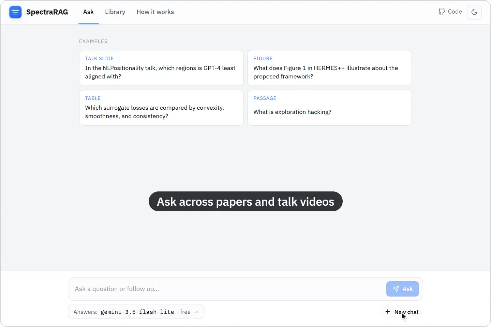
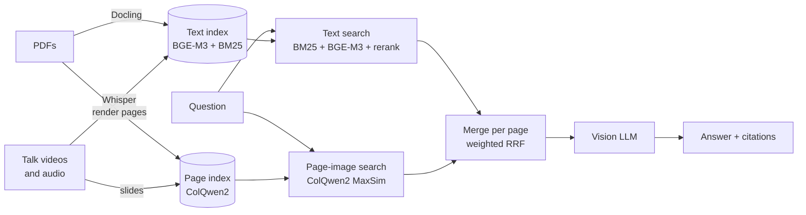

# SpectraRAG

[](https://github.com/NorthernLightx/spectrarag/actions/workflows/ci.yml)
[](https://github.com/NorthernLightx/spectrarag/actions/workflows/docker.yml)
[](https://github.com/NorthernLightx/spectrarag/actions/workflows/security.yml)
[](https://www.python.org/downloads/release/python-3120/)
[](./LICENSE)

## What is SpectraRAG

SpectraRAG is a self-hosted multimodal RAG system that answers questions from charts,
scanned tables, slides and speech, across PDFs, talk videos and audio, and
points to the page or timestamp each answer came from. It ships the full loop:
multimodal ingestion (Docling for PDFs, Whisper for recordings), an eval
harness on human-labelled golden sets, a per-query recall gate in CI, and ADRs
documenting the ablations behind its defaults.

**▶ Live demo: <https://spectrarag-demo.web.app>**



## Highlights

- **Finds answers in figures, tables and scans.** Each question searches both
  the text and the page images, and the results are merged into one ranked list
  of pages.
- **Points at the figure.** Figures and tables are indexed with their captions
  and positions, so an answer can show the exact region on the page.
- **Recordings (preview).** Talk videos and audio are transcribed into timed
  segments, and results come with start and end times.
- **Citations you can check.** Answers cite the passages and page images they
  use.
- **Runs without a GPU.** `spectrarag serve` needs no GPU and no other services.
- **Any model.** Search needs no LLM. `/answer` calls a model through
  OpenRouter, and `/context` returns the prompt so you can send it to your own.
- **Add PDFs while it runs.** `POST /ingest`, off by default.
- **Measured.** Search is benchmarked, and CI blocks a change that makes it find
  fewer right pages.

## How it works


```mermaid
flowchart LR
    PDF[PDFs] -->|Docling| TXTIDX[(Text index<br/>BGE-M3 + BM25)]
    PDF -->|render pages| PAGEIDX[(Page index<br/>ColQwen2)]
    REC[Talk videos<br/>and audio] -->|Whisper| TXTIDX
    REC -->|slides| PAGEIDX
    Q[Question] --> TXT[Text search<br/>BM25 + BGE-M3 + rerank]
    Q --> PAGE[Page-image search<br/>ColQwen2 MaxSim]
    TXTIDX --> TXT
    PAGEIDX --> PAGE
    TXT --> FUSE[Merge per page<br/>weighted RRF]
    PAGE --> FUSE
    FUSE --> LLM[Vision LLM]
    LLM --> A[Answer + citations]
```

1. **Index.** Docling splits each PDF into passages, figures and tables,
   indexed for keyword and meaning search (BM25 and BGE-M3). Each page is also
   indexed as an image (ColQwen2); this is the page index. Recordings are
   transcribed by Whisper into timed passages, and a talk's slides join the
   page index.
2. **Search.** Each question runs on both indexes, and the two result lists are
   merged page by page (weighted reciprocal-rank fusion).
3. **Answer.** A vision model reads the top passages and their page images,
   then answers with citations.

## Results

Finding the right page on [MMDocIR](https://arxiv.org/abs/2501.08828), 1,029
questions, from one recorded run
([`data/eval/mmdocir-depth50-legs.json.gz`](./data/eval/mmdocir-depth50-legs.json.gz)):
share of correct pages in the top 5 and top 10 results.

| search | top 5 | top 10 |
|---|---|---|
| text only | 0.42 | 0.46 |
| text and page images | 0.70 | 0.79 |
| page images only | **0.75** | **0.80** |

Answering 150 of those questions, a stratified sample, with the demo's search
(top 5 results) and `gemma4:31b` reading the pages, graded by `gpt-oss:120b`
against MMDocIR's answers
([`scoped`](./data/eval/answers-mmdocir-gen150-scoped.json.gz),
[`unscoped`](./data/eval/answers-mmdocir-gen150-unscoped.json.gz)). A quarter of
the questions say "the paper" or "Figure 1" and need their document named.

| each question searched | correct | refused | wrong |
|---|---|---|---|
| within its own document | **0.58** | 0.11 | 0.31 |
| across all 218 documents | 0.50 | 0.14 | 0.36 |

Method and full numbers: [`docs/results.md`](./docs/results.md). Where answer
accuracy is lost, and the fixes that did not help:
[`docs/finding-the-bottleneck.md`](./docs/finding-the-bottleneck.md).

Recordings: each question is searched within its own recording, against a
random order of that recording's segments.

| recordings | questions | right segment first | right segment in top 3 |
|---|---|---|---|
| talks with slides ([MCIF](https://arxiv.org/abs/2507.19634)) | 192 | 0.57 (random 0.10) | 0.82 (random 0.28) |
| meetings ([QMSum](https://arxiv.org/abs/2104.05938) on AMI) | 123 | 0.46 (random 0.17) | 0.75 (random 0.39) |

## Install and quickstart

Requirements: Python 3.12 and [uv](https://docs.astral.sh/uv/).

```bash
git clone https://github.com/NorthernLightx/spectrarag
cd spectrarag
uv sync --extra dev
uv run spectrarag serve
```

This serves the bundled demo papers; the first run downloads the models. The
API is at <http://localhost:8000>, with interactive docs at `/docs`.

```bash
curl -s localhost:8000/query -H "Content-Type: application/json" \
    -d '{"text": "What does Figure 1 in HERMES++ illustrate?", "top_k": 5}'
```

For answers with citations, set `RAG_OPENROUTER_API_KEY` in `.env` and send the
same body to `/answer`.

## Usage

### Query and answer

| route | what it does |
|---|---|
| `POST /query` | search only; `filters.paper_id` limits it to one document |
| `POST /answer` | search, then an answer with citations, through OpenRouter |
| `POST /context` | the prompt for one question, for a client that calls its own model |
| `POST /ingest` | add a PDF while it runs (needs `RAG_ENABLE_UPLOAD=true`) |
| `GET /papers`, `GET /figures` | the indexed documents, and their figures and tables |
| `GET /pages/...` | page images, when `RAG_PAGES_DIR` is set |
| `GET /health` | status, and a fingerprint of the search settings |
| `POST /query/dci` | experimental: an LLM agent searches the text with grep instead of the indexes (OpenRouter key in `X-OpenRouter-Key`, or the server's) |

The live demo is a separate web app built on this API.

### Add a PDF while it runs

The PDF is searchable right away, by text only.

```bash
RAG_ENABLE_UPLOAD=true uv run spectrarag serve
curl -F "file=@mydoc.pdf" localhost:8000/ingest
```

### Full local stack (Docker Qdrant and Ollama)

```bash
cp .env.example .env
docker compose up -d qdrant ollama
docker exec rag-ollama ollama pull bge-m3
uv run spectrarag fetch
uv run spectrarag ingest
uv run uvicorn src.api.main:app --port 8000
```

### Index your own PDFs

With the local stack running:

```bash
uv run spectrarag ingest --pdf-dir ./mydocs --collection my_corpus
```

Set `RAG_CORPUS_COLLECTION=my_corpus` in `.env` and restart the API.

### Turn on page-image search

Build the page index on a CUDA GPU (8 GB is enough); searching it runs on CPU.

```bash
uv run spectrarag fetch        # the demo corpus PDFs
uv run python -m scripts.build_visual_index
uv run python -m scripts.render_pages --pdf-dir data/papers
```

For your own corpus:

```bash
uv run python -m scripts.build_visual_index --pdf-dir ./mydocs \
    --qdrant http://localhost:6333 \
    --corpus-collection my_corpus --collection my_corpus_visual
```

Then set `RAG_ENABLE_MULTIMODAL=true`, `RAG_VISUAL_COLLECTION` and
`RAG_PAGES_DIR`. If answers live mostly in figures and scans, try
`RAG_VISUAL_FUSION_WEIGHT=2`.

### Index recordings (preview)

Videos (mp4, mov, mkv, webm) and audio (mp3, wav, m4a, flac, ogg, opus, aac):

```bash
uv sync --extra dev --extra media
uv run python -m scripts.ingest_media --media-dir ./recordings \
    --pages-dir data/recordings --qdrant path:./qdrant_media --collection recordings
```

For videos, also index the slide images (needs a CUDA GPU):

```bash
uv run python -m scripts.build_visual_index --pages-only --pages-dir data/recordings \
    --qdrant path:./qdrant_media --collection recordings_visual
```

Serve them:

```bash
RAG_QDRANT_URL=path:./qdrant_media RAG_CORPUS_COLLECTION=recordings \
RAG_PAGES_DIR=data/recordings uv run spectrarag serve
```

Add `RAG_ENABLE_MULTIMODAL=true` and `RAG_VISUAL_COLLECTION=recordings_visual`
to search the slide images too. Each result has `start_s` and `end_s` in its
metadata.

### Configuration

Set these in `.env` or the environment.

| variable | what it does | default |
|---|---|---|
| `RAG_OPENROUTER_API_KEY` | key for `/answer` | unset |
| `RAG_DEFAULT_CHAT_MODEL` | model `/answer` calls | `anthropic/claude-sonnet-4.6` |
| `RAG_PUBLIC_API_KEY` | key every request must send, except `/health` and the docs | unset (no auth) |
| `RAG_QDRANT_URL` | Qdrant server URL, or `path:<dir>` for a local store | `http://localhost:6333`; `spectrarag serve` uses `path:./qdrant_local` |
| `RAG_CORPUS_COLLECTION` | text collection to serve | `rag_corpus` |
| `RAG_ENABLE_MULTIMODAL` | turn on page-image search | `false` |
| `RAG_VISUAL_COLLECTION` | page index collection | `rag_corpus_visual` |
| `RAG_PAGES_DIR` | page images for `/pages` and the answer model | unset; `spectrarag serve` uses `data/pages` when present |
| `RAG_VISUAL_FUSION_WEIGHT` | weight of page-image results when merging | `1` |
| `RAG_ENABLE_UPLOAD` | allow `POST /ingest` | `false` |
| `RAG_PROFILE` | settings profile | unset; `spectrarag serve` uses `cpu` |

## Limitations

- Building the page index needs a CUDA GPU. Searching it runs on CPU.
- `POST /ingest` has no rate limit. On a shared deploy, keep
  `RAG_ENABLE_UPLOAD` off or set `RAG_PUBLIC_API_KEY`.
- One collection at a time; no user accounts or connectors.
- The demo papers are mostly text, so page-image search adds little on them.
- Recordings are a preview: no speaker labels, and the live demo has none yet.
- Transcription takes about 25 minutes per hour of audio on 8 CPU threads, so
  recordings are indexed from the command line; `POST /ingest` takes PDFs only.

## Evals

```bash
uv run python -m scripts.eval_run --profile cpu --pdf <files> --golden <golden.yaml>
uv run python -m scripts.check_regression --baseline <baseline.json> --candidate <run.json>
```

`eval_run` scores search, and optionally answers, on a set of questions with
known answers, and writes the results as JSON. `check_regression` fails if a
score drops more than 5% below a committed baseline.

On every push, CI runs the served setup on the demo papers, with and without
page-image search, and fails if any question loses a correct page from its top
10. CI has no GPU, so page-image results are replayed from a recording.

The LLM judge sees only text, so it can mark down a right answer read from an
image; for those, compare with the known answer.

Question-set format, metrics, and how to reproduce the numbers above:
[`docs/evals.md`](./docs/evals.md).

## Development

```bash
uv sync --extra dev
uv run ruff check . && uv run ruff format --check .
uv run mypy src tests scripts          # strict
uv run pytest -q -m "not slow and not integration"
```

CI also runs the slow and integration tests. To run the checks and a secret
scan before each push: `git config core.hooksPath .githooks`.

```
src/        API, retrievers, ingestion, eval, observability
scripts/    CLI entry points: ingest, index, eval, regression
data/       eval baselines, golden sets, the demo manifest
docs/       results, eval method, design notes
tests/      unit and integration suites
```

Contributing: [`CONTRIBUTING.md`](./CONTRIBUTING.md). Design notes:
[`docs/decisions/`](./docs/decisions/README.md).

## References

- **Models:** [ColQwen2](https://huggingface.co/vidore/colqwen2-v1.0) from the
  ColPali line ([arXiv:2407.01449](https://arxiv.org/abs/2407.01449)),
  [BGE-M3](https://huggingface.co/BAAI/bge-m3)
  ([arXiv:2402.03216](https://arxiv.org/abs/2402.03216)), the
  [ms-marco-MiniLM-L-6-v2](https://huggingface.co/cross-encoder/ms-marco-MiniLM-L-6-v2)
  and [BGE-reranker-v2-m3](https://huggingface.co/BAAI/bge-reranker-v2-m3)
  rerankers, [Whisper large-v3-turbo](https://huggingface.co/openai/whisper-large-v3-turbo)
  through [faster-whisper](https://github.com/SYSTRAN/faster-whisper).
- **Libraries:** [Docling](https://github.com/docling-project/docling)
  ([arXiv:2408.09869](https://arxiv.org/abs/2408.09869)),
  [Qdrant](https://qdrant.tech/), [rank-bm25](https://github.com/dorianbrown/rank_bm25),
  [PyMuPDF](https://github.com/pymupdf/PyMuPDF),
  [FastAPI](https://fastapi.tiangolo.com/), [OpenRouter](https://openrouter.ai/),
  [Ollama](https://ollama.com/), [OpenTelemetry](https://opentelemetry.io/),
  [Sentry](https://sentry.io/), [Langfuse](https://langfuse.com/).
- **Benchmarks:** [MMDocIR](https://arxiv.org/abs/2501.08828),
  [MMLongBench-Doc](https://arxiv.org/abs/2407.01523),
  [MCIF](https://arxiv.org/abs/2507.19634) (CC BY 4.0),
  [QMSum](https://arxiv.org/abs/2104.05938) on the AMI Meeting Corpus
  (CC BY 4.0), and [BRIGHT](https://arxiv.org/abs/2407.12883) for the agentic
  search endpoint, which follows
  [arXiv:2605.05242](https://arxiv.org/abs/2605.05242).
- **Comparison** with other document-RAG tools:
  [`docs/comparison.md`](./docs/comparison.md).

## License

MIT. See [`LICENSE`](./LICENSE).
